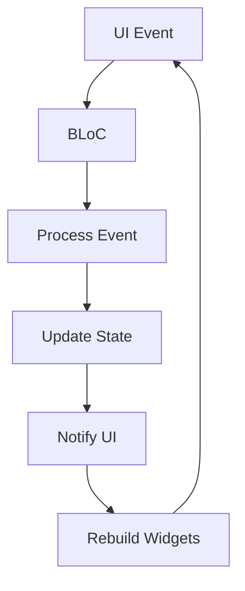
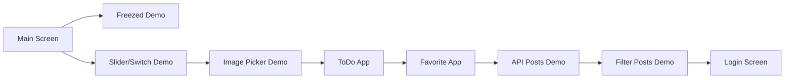

# 🚀 BlocLabs - Flutter BLoC Pattern Showcase

[](https://flutter.dev)
[](https://dart.dev)
[](https://bloclibrary.dev)
[](LICENSE)

A comprehensive Flutter project demonstrating various implementations of the BLoC (Business Logic Component) pattern with multiple real-world examples.

## 📁 Project Structure

```
lib/
├── authentication_app/
│   ├── bloc/
│   └── ui/
├── counter_app/
│   ├── bloc/
│   └── ui/
├── equatable_demo/
├── favourite_app/
│   ├── bloc/
│   ├── model/
│   ├── repository/
│   └── ui/
├── filter_api_list_demo/
│   ├── bloc/
│   ├── model/
│   ├── repository/
│   ├── ui/
│   └── utils/
├── freezed_package_demo/
│   ├── model/
│   └── ui/
├── get_api_demo/
│   ├── bloc/
│   ├── model/
│   ├── repository/
│   ├── ui/
│   └── utils/
├── image_picker_demo/
│   ├── bloc/
│   ├── ui/
│   └── utils/
├── slider_and_switch_demo/
│   ├── bloc/
│   └── ui/
├── todo_app/
│   ├── bloc/
│   └── ui/
└── main.dart
```

## 🎯 Main Modules & Features

### 1. 🔢 Counter App
A simple counter implementation demonstrating basic BLoC pattern usage.

**Key Components:**
- `CounterBloc` - Manages increment/decrement operations
- `CounterEvent` - Abstract events: `IncrementCounter`, `DecrementCounter`
- `CounterState` - Holds counter value with `copyWith` method

**Data Flow:**
```dart
// Event triggered by UI
context.read<CounterBloc>().add(IncrementCounter());

// Bloc processes event
on<IncrementCounter>(_onIncrement);

// State updated
emit(state.copyWith(counter: state.counter + 1));
```

### 2. 🎚️ Slider & Switch Demo
Demonstrates managing UI components with BLoC pattern.

**Key Components:**
- `SliderBloc` - Manages slider opacity value
- `SwitchBloc` - Manages notification toggle state
- Events: `ChangeOpacity`, `EnableOrDisableNotification`

**Optimization:**
```dart
// Using buildWhen to prevent unnecessary rebuilds
BlocBuilder<SwitchBloc, SwitchState>(
  buildWhen: (previous, current) => previous.isNotification != current.isNotification,
  builder: (context, state) {
    return Switch(
      value: state.isNotification,
      onChanged: (value) => context.read<SwitchBloc>().add(EnableOrDisableNotification()),
    );
  },
)
```

### 3. 📷 Image Picker Demo
Implementation of image picking functionality using device camera/gallery.

**Key Components:**
- `ImagePickerBloc` - Handles image selection from camera/gallery
- `ImagePickerUtils` - Utility class for image picking operations
- Events: `CameraCapture`, `GalleryImagePicker`

### 4. ✅ Todo App
A todo list application demonstrating list management with BLoC.

**Key Components:**
- `ToDoBloc` - Manages todo list operations
- Events: `AddToDoEvent`, `RemoveToDoEvent`
- State holds list of todo items

**Implementation:**
```dart
// Adding items to list
void _onAddToDoEvent(AddToDoEvent event, Emitter<ToDoState> emit) {
  _todos.add(event.task);
  emit(state.copyWith(todos: List.from(_todos)));
}
```

### 5. ❤️ Favorite App
A favorite items management system with selection and deletion capabilities.

**Key Components:**
- `FavouriteBloc` - Manages favorite items with selection functionality
- `FavouriteRepository` - Handles data fetching
- Events: `FetchFavouriteList`, `SelectItem`, `UnSelectItem`, `DeleteItem`

**Features:**
- Multi-selection with checkboxes
- Bulk deletion of selected items
- Favorite toggle functionality

### 6. 🌐 API Integration Demos

#### Get API Demo
Fetches and displays data from JSONPlaceholder API.

**Key Components:**
- `PostsBloc` - Manages API data fetching
- `PostRepository` - Handles HTTP requests
- `PostModel` - Data model for API response

#### Filter API List Demo
Extends the API demo with search functionality.

**Key Components:**
- `FilterPostsBloc` - Adds search capability to posts
- `SearchItem` event for filtering
- Real-time search as user types

### 7. 🔐 Authentication App
Demonstrates authentication flow with email/password.

**Key Components:**
- `LoginBloc` - Manages login process
- Events: `EmailChanged`, `PasswordChanged`, `LoginAPI`
- Integration with reqres.in authentication API

### 8. 🧊 Equatable Demo
Shows the difference between manual equality implementation and using the Equatable package.

**Key Concepts:**
- Manual `==` operator and `hashCode` implementation
- Equatable package for automatic equality generation

### 9. 🧊 Freezed Package Demo
Demonstrates using the Freezed package for immutable models.

**Key Components:**
- `AnimalModel` - Freezed-based model with automatic code generation
- `PersonModel` - Manual model implementation for comparison

## 🔄 Data Flow & Component Interaction



## 📱 App Flow Diagram



## 🛠️ Technologies Used

- **Flutter** - UI Framework
- **Dart** - Programming Language
- **Bloc** - State Management
- **Equatable** - Value equality comparisons
- **Freezed** - Immutable models and unions
- **HTTP** - API communication
- **Image Picker** - Camera/Gallery integration

## 🚀 Getting Started

1. Clone the repository
2. Run `flutter pub get`
3. Run `flutter run`

## 📝 Usage Examples

### Creating a BLoC

```dart
// CounterBloc implementation
class CounterBloc extends Bloc<CounterEvent, CounterState> {
  CounterBloc() : super(const CounterState()) {
    on<IncrementCounter>(_onIncrement);
    on<DecrementCounter>(_onDecrement);
  }

  void _onIncrement(IncrementCounter event, Emitter<CounterState> emit) {
    emit(state.copyWith(counter: state.counter + 1));
  }

  void _onDecrement(DecrementCounter event, Emitter<CounterState> emit) {
    emit(state.copyWith(counter: state.counter - 1));
  }
}
```

### Using BLoC in UI

```dart
// Providing BLoC to widget tree
BlocProvider<CounterBloc>(
  create: (context) => CounterBloc(),
  child: CounterScreen(),
)

// Consuming BLoC state
BlocBuilder<CounterBloc, CounterState>(
  builder: (context, state) {
    return Text("${state.counter}");
  },
)

// Triggering events
ElevatedButton(
  onPressed: () => context.read<CounterBloc>().add(IncrementCounter()),
  child: Text("Increment"),
)
```

## 🤝 Contributing

This project is for educational purposes and demonstrates various BLoC pattern implementations.

## 📄 License

This project is licensed under the MIT License - see the [LICENSE](LICENSE) file for details.