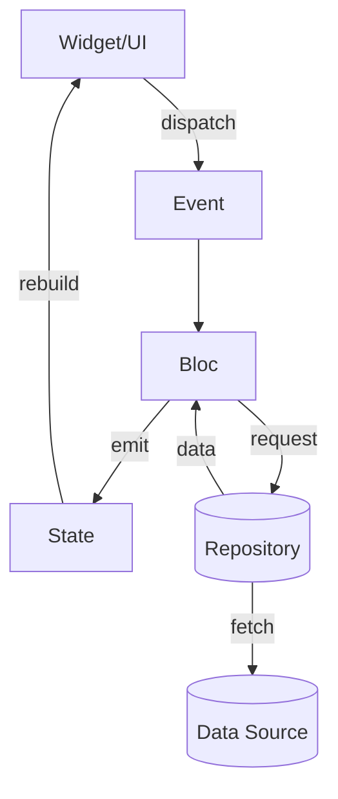

## 🌈 BlocLabs — Flutter BLoC Demos

> A curated collection of mini apps demonstrating idiomatic Flutter BLoC patterns: counters, slider/switch state, image picking, todos, favourites, API fetching, and client-side filtering. Built with `flutter_bloc`, `equatable`, and clean BLoC layering.

---

### 🔖 Badges
- **Tech**:   
- **HTTP**: 
- **Media**: 

> Note: Firebase is not used in this project; badges reflect actual dependencies/features.

---

### 🧭 Overview
- **Entry point**: `lib/main.dart` wires multiple BLoCs via `MultiBlocProvider` and boots into `CounterScreen()`.
- **Architecture style**: Feature-first + BLoC triad per feature (`bloc/ event/ state`) with optional `model/ repository/ utils/ ui`.
- **Navigation**: Demo screens navigate directly (e.g., Counter → Filtered Posts) via `Navigator.push`.

```23:73:lib/main.dart
void main() {
  runApp(const MyApp());
}

class MyApp extends StatelessWidget {
  const MyApp({super.key});
  @override
  Widget build(BuildContext context) {
    return MultiBlocProvider(
      providers: [
        BlocProvider<SwitchBloc>(create: (context) => SwitchBloc()),
        BlocProvider<SliderBloc>(create: (context) => SliderBloc()),
        BlocProvider<ImagePickerBloc>(create: (context) => ImagePickerBloc(ImagePickerUtils())),
        BlocProvider<ToDoBloc>(create: (context) => ToDoBloc()),
        BlocProvider<FavouriteBloc>(create: (context) => FavouriteBloc(FavouriteRepository())),
        BlocProvider<PostsBloc>(create: (context) => PostsBloc()),
        BlocProvider<FilterPostsBloc>(create: (context) => FilterPostsBloc()),
      ],
      child: MaterialApp(
        debugShowCheckedModeBanner: false,
        theme: ThemeData(useMaterial3: true, brightness: Brightness.dark),
        home: CounterScreen(),
      ),
    );
  }
}
```

---

### 🗂️ Folder Structure (High-level)

```text
lib/
  counter_app/            # Counter BLoC demo
  equatable_demo/         # Equality semantics with Equatable
  favourite_app/          # Select/delete + favourite toggles with repository
  filter_api_list_demo/   # Search/filter client-side over API data
  get_api_demo/           # API fetching and render list
  image_picker_demo/      # Camera/gallery image picker with BLoC
  slider_and_switch_demo/ # Independent slider + switch BLoCs
  todo_app/               # Simple ToDo with add/remove
  main.dart               # Bootstraps providers and theme
```

---

### 🧩 Core Concepts
- **BLoC pattern**: Each feature defines `Event`, `State`, and `Bloc` classes.
- **Equatable**: Ensures efficient widget rebuilds via structural equality on states/models.
- **Repository**: Abstracts data sources (e.g., network, generated list) per feature.
- **UI**: Uses `BlocBuilder` with optional `buildWhen` to optimize rebuilding.

---

### 📱 Features & Data Flow

#### 1) Counter App
- Increments/decrements an integer via events.
- The screen disposes its own `CounterBloc` instance.

```1:18:lib/counter_app/bloc/counter_bloc.dart
class CounterBloc extends Bloc<CounterEvent, CounterState> {
  CounterBloc() : super(const CounterState()) {
    on<IncrementCounter>(_onIncrement);
    on<DecrementCounter>(_onDecrement);
  }
  void _onIncrement(IncrementCounter event, Emitter<CounterState> emit) {
    emit(state.copyWith(counter: state.counter + 1));
  }
  void _onDecrement(DecrementCounter event, Emitter<CounterState> emit) {
    emit(state.copyWith(counter: state.counter - 1));
  }
}
```

```30:88:lib/counter_app/ui/counter_screen.dart
@override
Widget build(BuildContext context) {
  return SafeArea(
    child: BlocProvider<CounterBloc>(
      create: (context) => _bloc,
      child: Scaffold(
        appBar: AppBar(title: Text("Counter App Demo"), centerTitle: true),
        body: Center(
          child: Column(
            children: [
              BlocBuilder<CounterBloc, CounterState>(
                builder: (context, state) {
                  return Text("${state.counter}", style: TextStyle(fontSize: 60));
                },
              ),
              Row(
                children: [
                  ElevatedButton.icon(
                    onPressed: () => context.read<CounterBloc>().add(IncrementCounter()),
                    label: Text("Increment"),
                    icon: Icon(Icons.add_circle_rounded),
                  ),
                  ElevatedButton.icon(
                    onPressed: () => context.read<CounterBloc>().add(DecrementCounter()),
                    label: Text("Decrement"),
                    icon: Icon(Icons.remove_circle_rounded),
                  ),
                ],
              ),
              ElevatedButton.icon(
                onPressed: () => Navigator.push(context, MaterialPageRoute(builder: (context) => FilterPostsScreen())),
                label: Text("Next"),
                icon: Icon(Icons.navigate_next),
              ),
            ],
          ),
        ),
      ),
    ),
  );
}
```

- **Flow**: `Button Tap` → `CounterEvent` → `CounterBloc` mutates `CounterState` → `BlocBuilder` rebuilds `Text`.

---

#### 2) Slider & Switch Demo
- Independent BLoCs: `SliderBloc` controls container opacity; `SwitchBloc` toggles notifications.
- Uses `buildWhen` to limit unnecessary rebuilds.

```5:13:lib/slider_and_switch_demo/bloc/slider/slider_bloc.dart
class SliderBloc extends Bloc<SliderEvent, SliderState> {
  SliderBloc() : super(SliderState()) {
    on<ChangeOpacity>(_onChangeOpacity);
  }
  void _onChangeOpacity(ChangeOpacity event, Emitter<SliderState> emit) {
    emit(state.copyWith(opacity: event.opacity));
  }
}
```

```41:53:lib/slider_and_switch_demo/ui/slider_and_switch_screen.dart
BlocBuilder<SliderBloc, SliderState>(
  buildWhen: (previous, current) => previous.opacity != current.opacity,
  builder: (context, state) => Slider(
    value: state.opacity,
    onChanged: (value) => context.read<SliderBloc>().add(ChangeOpacity(opacity: value)),
  ),
)
```

- **Flow**: `Slider.onChanged(value)` → `ChangeOpacity` → `SliderBloc` → `opacity` updates → `Container` visuals update.

---

#### 3) Image Picker Demo
- Captures image from camera or gallery via `image_picker` wrapped in BLoC.

```7:24:lib/image_picker_demo/bloc/image_picker_bloc.dart
class ImagePickerBloc extends Bloc<ImagePickerEvent, ImagePickerState> {
  final ImagePickerUtils utils;
  ImagePickerBloc(this.utils) : super(ImagePickerState()) {
    on<CameraCapture>(_onCameraCapture);
    on<GalleryImagePicker>(_onGalleryImagePicker);
  }
  Future<void> _onCameraCapture(CameraCapture event, Emitter<ImagePickerState> emit) async {
    XFile? file = await utils.onCameraCapture();
    emit(state.copyWith(image: file));
  }
  Future<void> _onGalleryImagePicker(GalleryImagePicker event, Emitter<ImagePickerState> emit) async {
    XFile? file = await utils.onPickFromGallery();
    emit(state.copyWith(image: file));
  }
}
```

```18:38:lib/image_picker_demo/ui/image_picker_screen.dart
return state.image == null
  ? Row(
      children: [
        InkWell(
          onTap: () => context.read<ImagePickerBloc>().add(CameraCapture()),
          child: CircleAvatar(child: Icon(Icons.camera)),
        ),
        InkWell(
          onTap: () => context.read<ImagePickerBloc>().add(GalleryImagePicker()),
          child: CircleAvatar(child: Icon(Icons.photo_library_rounded)),
        ),
      ],
    )
  : Image.file(File(state.image!.path));
```

- **Flow**: `Tap Camera/Gallery` → `ImagePickerEvent` → `ImagePickerUtils` → state holds `XFile` → UI renders image.

---

#### 4) ToDo App
- Minimal add/remove with immutable state updates.

```5:27:lib/todo_app/bloc/todo_bloc.dart
class ToDoBloc extends Bloc<ToDoEvent, ToDoState> {
  final List<String> _todos = [];
  ToDoBloc() : super(ToDoState()) {
    on<AddToDoEvent>(_onAddToDoEvent);
    on<RemoveToDoEvent>(_onRemoveToDoEvent);
  }
  void _onAddToDoEvent(AddToDoEvent event, Emitter<ToDoState> emit) {
    _todos.add(event.task);
    emit(state.copyWith(todos: List.from(_todos)));
  }
  void _onRemoveToDoEvent(RemoveToDoEvent event, Emitter<ToDoState> emit) {
    _todos.remove(event.task);
    emit(state.copyWith(todos: List.from(_todos)));
  }
}
```

```12:41:lib/todo_app/ui/todo_screen.dart
return ListView.builder(
  itemCount: state.todos.length,
  itemBuilder: (context, index) {
    return ListTile(
      title: Text(state.todos[index]),
      trailing: IconButton(
        onPressed: () => context.read<ToDoBloc>().add(RemoveToDoEvent(task: state.todos[index])),
        icon: Icon(Icons.delete_rounded),
      ),
    );
  },
);
```

- **Flow**: `FAB Add` → `AddToDoEvent` → state list grows → UI rebuilds. `Delete` similarly removes.

---

#### 5) Favourites App
- Loads items via repository, supports multi-select (with strike-through), deletion, and toggling favourite hearts.

```7:52:lib/favourite_app/bloc/favourite_bloc.dart
class FavouriteBloc extends Bloc<FavouriteEvents, FavouriteState> {
  List<FavouriteItemModel> items = [];
  List<FavouriteItemModel> temp_items = [];
  FavouriteRepository repository;

  FavouriteBloc(this.repository) : super(const FavouriteState()) {
    on<FetchFavouriteList>(onFetchList);
    add(FetchFavouriteList());
    on<AddFavouriteItem>(_onAddFavouriteItem);
    on<SelectItem>(_onSelectItem);
    on<UnSelectItem>(_onUnSelectItem);
    on<DeleteItem>(_onDeleteItems);
  }
  Future<void> onFetchList(FetchFavouriteList event, Emitter<FavouriteState> emit) async {
    items = await repository.onFetchItems();
    emit(state.copyWith(items: List.from(items), status: ListStatus.success));
  }
  void _onAddFavouriteItem(AddFavouriteItem event, Emitter<FavouriteState> emit) {
    final index = items.indexWhere((e) => e.id == event.item.id);
    items[index] = event.item;
    if (temp_items.isNotEmpty) {
      final temp_index = temp_items.indexWhere((e) => e.id == event.item.id);
      if (temp_index != -1) temp_items[temp_index] = event.item;
    }
    emit(state.copyWith(items: List.from(items), temp_items: List.from(temp_items)));
  }
  void _onSelectItem(SelectItem event, Emitter<FavouriteState> emit) {
    temp_items.add(event.item);
    emit(state.copyWith(temp_items: List.from(temp_items)));
  }
  void _onUnSelectItem(UnSelectItem event, Emitter<FavouriteState> emit) {
    temp_items.remove(event.item);
    emit(state.copyWith(temp_items: List.from(temp_items)));
  }
  void _onDeleteItems(DeleteItem event, Emitter<FavouriteState> emit) {
    items.removeWhere((e) => temp_items.contains(e));
    temp_items.clear();
    emit(state.copyWith(items: List.from(items), temp_items: List.from(temp_items)));
  }
}
```

```33:83:lib/favourite_app/ui/favourite_app_screen.dart
BlocBuilder<FavouriteBloc, FavouriteState>(
  builder: (context, state) {
    switch (state.status) {
      case ListStatus.loading:
        return Center(child: CircularProgressIndicator());
      case ListStatus.success:
        return ListView.builder(
          itemCount: state.items.length,
          itemBuilder: (context, index) {
            final item = state.items[index];
            return Card(
              child: ListTile(
                leading: Checkbox(
                  value: state.temp_items.contains(item) ? true : false,
                  onChanged: (value) {
                    if (value == true) {
                      context.read<FavouriteBloc>().add(SelectItem(item: item));
                    } else {
                      context.read<FavouriteBloc>().add(UnSelectItem(item: item));
                    }
                  },
                ),
                title: Text(
                  item.value,
                  style: TextStyle(
                    decoration: state.temp_items.contains(item) ? TextDecoration.lineThrough : null,
                    decorationColor: Colors.red,
                    color: state.temp_items.contains(item) ? Colors.red : Colors.white,
                  ),
                ),
                trailing: IconButton(
                  onPressed: () => context.read<FavouriteBloc>().add(
                    AddFavouriteItem(
                      item: FavouriteItemModel(id: item.id, value: item.value, isFavourite: item.isFavourite ? false : true),
                    ),
                  ),
                  icon: item.isFavourite ? Icon(Icons.favorite_rounded) : Icon(Icons.favorite_outline_rounded),
                ),
              ),
            );
          },
        );
      case ListStatus.failure:
        return Center(child: Text("Something went wrong"));
    }
  },
)
```

- **Flow**: `FetchFavouriteList` on init → repository generates list → user selects items (temp list) → `DeleteItem` removes selected → heart toggles via `AddFavouriteItem`.

---

#### 6) Get API Demo (Comments)
- Fetches from `https://jsonplaceholder.typicode.com/comments` and renders a list.

```7:25:lib/get_api_demo/repository/post_repository.dart
class PostRepository {
  Future<List<PostModel>> onFetchPosts() async {
    final response = await http.get(
      Uri.parse('https://jsonplaceholder.typicode.com/comments'),
      headers: {'Content-Type': 'application/json'},
    );
    if (response.statusCode == 200) {
      final posts = json.decode(response.body) as List;
      return posts.map((e) => PostModel.fromJson(e)).toList();
    }
    throw Exception("Error on fetching posts");
  }
}
```

```10:24:lib/get_api_demo/bloc/posts_bloc.dart
PostsBloc() : super(const PostsState()) {
  on<PostsFetched>(onFetchPosts);
  add(PostsFetched());
}
Future<void> onFetchPosts(PostsFetched event, Emitter<PostsState> emit) async {
  await repo.onFetchPosts()
    .then((value) {
      emit(state.copyWith(status: PostsStatus.success, posts: value, message: 'Success'));
    })
    .catchError((error, stackTrace) {
      emit(state.copyWith(status: PostsStatus.failure, message: error.toString()));
    });
}
```

- **Flow**: `PostsFetched` on init → repository fetch → success/failure state → UI renders list or message.

---

#### 7) Filter API List Demo
- Same dataset as above, but includes client-side email search with immediate feedback.

```12:41:lib/filter_api_list_demo/bloc/filter_posts_bloc.dart
FilterPostsBloc() : super(const FilterPostsState()) {
  on<PostsFetched>(onFetchPosts);
  add(PostsFetched());
  on<SearchItem>(onSearchItem);
}
void onSearchItem(SearchItem event, Emitter<FilterPostsState> emit) {
  if (event.item.isEmpty) {
    emit(state.copyWith(temp_posts: [], search_message: ''));
  } else {
    temp_posts = state.posts.where((e) => e.email.toString().toLowerCase().contains(event.item.toLowerCase())).toList();
    if (temp_posts.isEmpty) {
      emit(state.copyWith(temp_posts: temp_posts, search_message: "No data found"));
    } else {
      emit(state.copyWith(temp_posts: temp_posts, search_message: ''));
    }
  }
}
```

```24:51:lib/filter_api_list_demo/ui/filter_posts_screen.dart
TextFormField(
  decoration: InputDecoration(hintText: 'Search with email', border: OutlineInputBorder()),
  onChanged: (value) => context.read<FilterPostsBloc>().add(SearchItem(value)),
),
Expanded(
  child: state.search_message.trim().isNotEmpty
    ? Center(child: Text(state.search_message))
    : ListView.builder(
        itemCount: state.temp_posts.isNotEmpty ? state.temp_posts.length : state.posts.length,
        itemBuilder: (context, index) {
          final item = state.temp_posts.isNotEmpty ? state.temp_posts[index] : state.posts[index];
          return ListTile(
            title: Text("Name: ${item.name ?? ""}\nEmail: ${item.email ?? ""}"),
            subtitle: Text(item.body ?? ""),
          );
        },
      ),
)
```

- **Flow**: `onChanged` → `SearchItem` → filter `posts` → show `temp_posts` or message.

---

#### 8) Equatable Demo
- Console-only demo highlighting why `Equatable` is useful for value equality in Dart classes.

```48:72:lib/equatable_demo/equatable_demo.dart
class NewPerson extends Equatable {
  final String name;
  final int age;
  const NewPerson({required this.name, required this.age});
  @override
  List<Object?> get props => [name, age];
}
```

---

### 🔌 Key Classes & Responsibilities

- **`Bloc` classes**: Orchestrate state transitions (`CounterBloc`, `SliderBloc`, `SwitchBloc`, `ImagePickerBloc`, `ToDoBloc`, `FavouriteBloc`, `PostsBloc`, `FilterPostsBloc`).
- **`State` classes**: Immutable snapshots of UI state; equatable for rebuild control.
- **`Event` classes**: User or lifecycle intents mapped to transitions.
- **`Repository` classes**: Data access boundaries (`PostRepository`, `FilterPostRepository`, `FavouriteRepository`).
- **`Model` classes**: DTOs (`PostModel`, `FilterPostModel`, `FavouriteItemModel`).
- **`Utils`**: Imperative helpers (`ImagePickerUtils`).

---

### 🧠 Data Flow Diagram (Simplified)



---

### 🌟 UI Flow (Demo Navigation)
- `CounterScreen` → taps "Next" → `FilterPostsScreen`.
- Other feature screens are ready to be used by setting them as `home:` in `main.dart` or via `Navigator` from any screen.

---

### 🧪 Notable Implementation Details
- `BlocBuilder.buildWhen` used to reduce rebuilds (e.g., buttons and opacity changes).
- `MultiBlocProvider` sets up shared BLoCs at the app root.
- Network calls are naive (no caching/error retries) to keep demos focused.
- All states and models use `Equatable` for reliable equality.

---

### 📋 Feature Matrix

| Feature | Bloc | Events | State | Repository | Notes |
|---|---|---|---|---|---|
| Counter | `CounterBloc` | `IncrementCounter`, `DecrementCounter` | `CounterState(counter)` | – | Simple integer state |
| Slider | `SliderBloc` | `ChangeOpacity(opacity)` | `SliderState(opacity)` | – | Visual opacity control |
| Switch | `SwitchBloc` | `EnableOrDisableNotification` | `SwitchState(isNotification)` | – | Toggle notifications |
| Image Picker | `ImagePickerBloc` | `CameraCapture`, `GalleryImagePicker` | `ImagePickerState(image)` | `ImagePickerUtils` | Uses `image_picker` |
| ToDo | `ToDoBloc` | `AddToDoEvent`, `RemoveToDoEvent` | `ToDoState(todos)` | – | Immutable list updates |
| Favourites | `FavouriteBloc` | `FetchFavouriteList`, `SelectItem`, `UnSelectItem`, `AddFavouriteItem`, `DeleteItem` | `FavouriteState(items,temp_items,status)` | `FavouriteRepository` | Multi-select + heart toggle |
| Get API | `PostsBloc` | `PostsFetched` | `PostsState(status,posts,message)` | `PostRepository` | Fetches comments list |
| Filter API | `FilterPostsBloc` | `PostsFetched`, `SearchItem` | `FilterPostsState(status,posts,temp_posts,search_message)` | `FilterPostRepository` | Client-side email filter |
| Equatable Demo | – | – | – | – | Equality semantics showcase |

---

### 🎯 How to Explore Demos Quickly
- In `lib/main.dart`, switch `home:` to any feature screen (e.g., `ImagePickerScreen()`, `FavouriteAppScreen()`, `SliderAndSwitchScreen()`, `PostsScreen()`, `TodoScreen()`).
- Alternatively, add buttons or routes to jump between demos.

---

### 🧱 Tech Highlights
- `flutter_bloc`, `equatable`, `http`, `image_picker`.
- Material 3 theming with dark mode by default.

---

### 📎 Notes
- This README focuses on project architecture and features; installation and meta details are intentionally omitted as requested.
