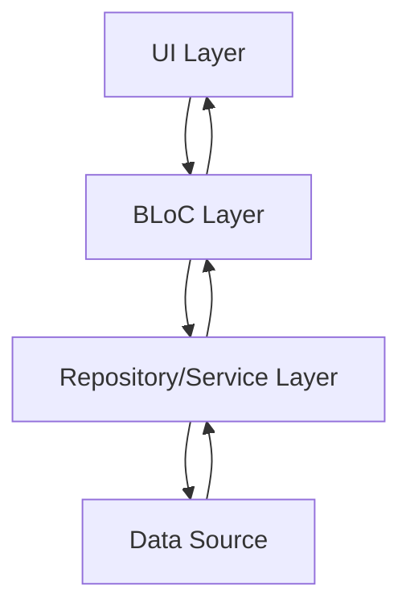
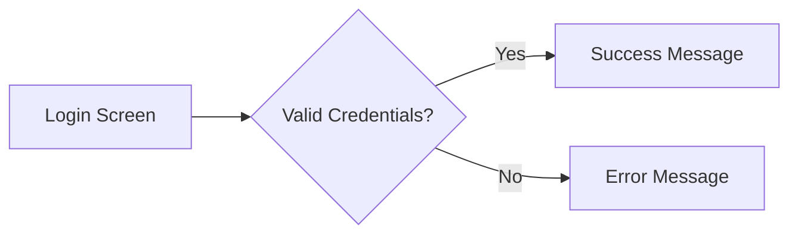
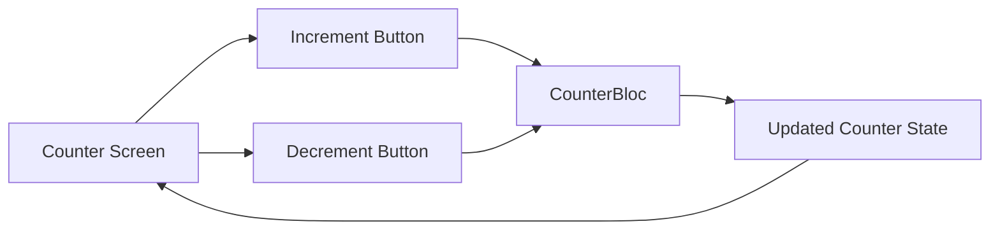
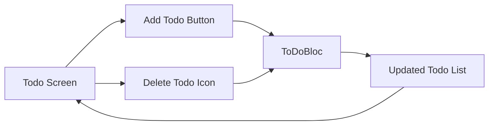
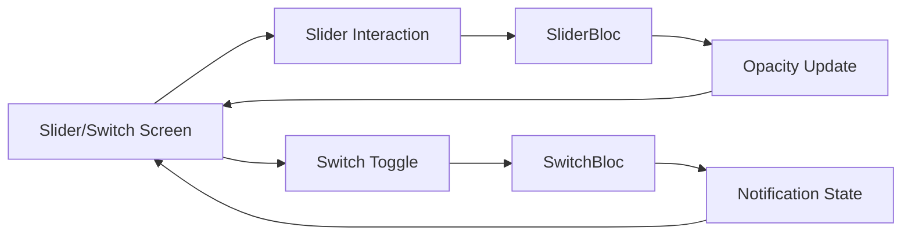
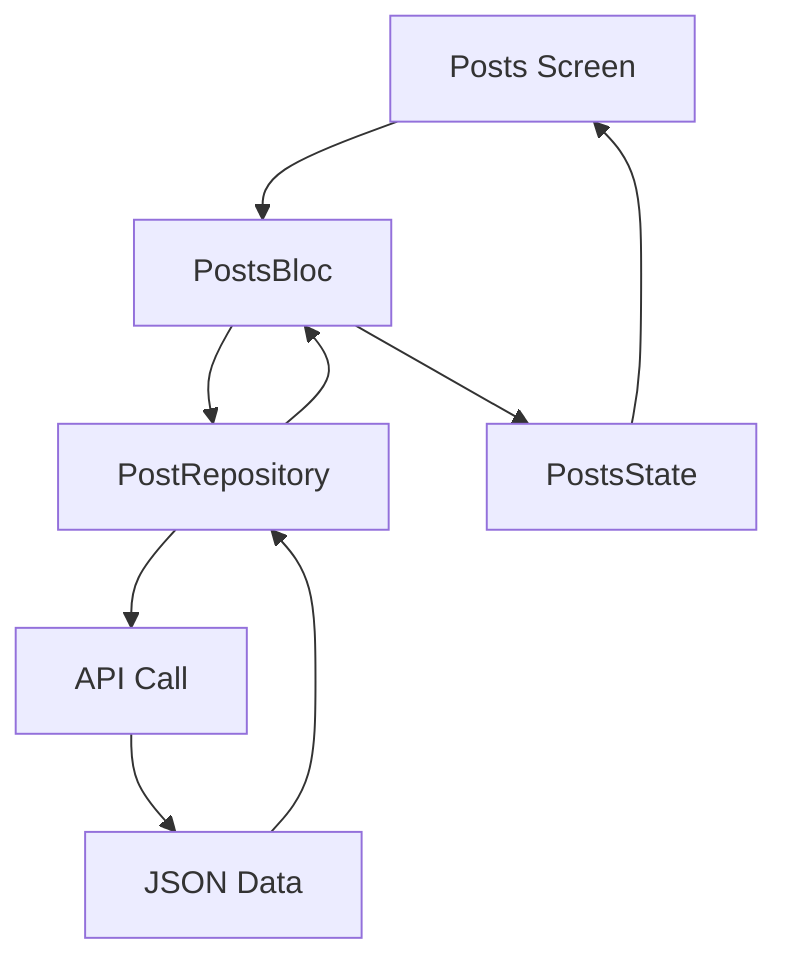
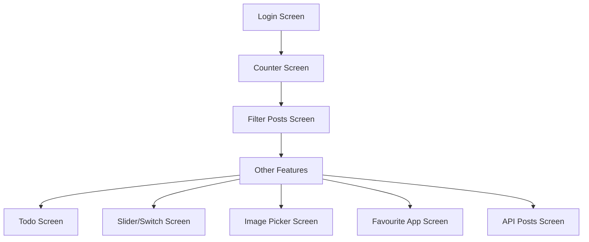

# BlocLabs 🚀

[](https://flutter.dev)
[](https://dart.dev)
[](https://bloclibrary.dev)
[](https://jsonplaceholder.typicode.com)

A comprehensive Flutter project showcasing various implementations of the BLoC (Business Logic Component) pattern with real-world examples including state management, API integration, image picking, and more.

## 📁 Project Architecture & Folder Structure

```
lib/
├── authentication_app/
│   ├── bloc/
│   └── ui/
├── counter_app/
│   ├── bloc/
│   └── ui/
├── equatable_demo/
├── favourite_app/
│   ├── bloc/
│   ├── model/
│   ├── repository/
│   └── ui/
├── filter_api_list_demo/
│   ├── bloc/
│   ├── model/
│   ├── repository/
│   ├── ui/
│   └── utils/
├── get_api_demo/
│   ├── bloc/
│   ├── model/
│   ├── repository/
│   ├── ui/
│   └── utils/
├── image_picker_demo/
│   ├── bloc/
│   ├── ui/
│   └── utils/
├── slider_and_switch_demo/
│   ├── bloc/
│   │   ├── slider/
│   │   └── switch/
│   └── ui/
├── todo_app/
│   ├── bloc/
│   └── ui/
└── main.dart
```

## 🎯 Main Modules & Features

### 1. 🔢 Counter App
A simple counter implementation demonstrating basic BLoC state management.

**Key Components:**
- [CounterBloc](lib/counter_app/bloc/counter_bloc.dart) - Handles increment/decrement logic
- [CounterEvent](lib/counter_app/bloc/counter_event.dart) - Abstract events (IncrementCounter, DecrementCounter)
- [CounterState](lib/counter_app/bloc/counter_state.dart) - State containing counter value
- [CounterScreen](lib/counter_app/ui/counter_screen.dart) - UI with buttons to modify counter

### 2. ✅ Todo App
A todo list application showcasing list management with BLoC.

**Key Components:**
- [ToDoBloc](lib/todo_app/bloc/todo_bloc.dart) - Manages todo list operations
- [ToDoEvent](lib/todo_app/bloc/todo_event.dart) - Events for adding/removing todos
- [ToDoState](lib/todo_app/bloc/todo_state.dart) - State containing list of todos
- [TodoScreen](lib/todo_app/ui/todo_screen.dart) - UI displaying todos with add/remove functionality

### 3. 🔐 Authentication App
A login implementation demonstrating API integration with BLoC.

**Key Components:**
- [LoginBloc](lib/authentication_app/bloc/login_bloc.dart) - Handles login process
- [LoginEvent](lib/authentication_app/bloc/login_event.dart) - Events for email/password changes and login
- [LoginState](lib/authentication_app/bloc/login_state.dart) - State with login status and credentials
- [LoginScreen](lib/authentication_app/ui/login_screen.dart) - Login UI with form validation

### 4. 🎚️ Slider & Switch Demo
Demonstrates managing multiple BLoCs in a single screen.

**Key Components:**
- [SliderBloc](lib/slider_and_switch_demo/bloc/slider/slider_bloc.dart) - Manages slider opacity value
- [SwitchBloc](lib/slider_and_switch_demo/bloc/switch/switch_bloc.dart) - Manages switch notification state
- [SliderAndSwitchScreen](lib/slider_and_switch_demo/ui/slider_and_switch_screen.dart) - UI with interactive slider and switch

### 5. 📷 Image Picker Demo
Implementation of image picking from camera/gallery using BLoC.

**Key Components:**
- [ImagePickerBloc](lib/image_picker_demo/bloc/image_picker_bloc.dart) - Handles image picking operations
- [ImagePickerUtils](lib/image_picker_demo/utils/image_picker_utils.dart) - Utility for camera/gallery access
- [ImagePickerScreen](lib/image_picker_demo/ui/image_picker_screen.dart) - UI for picking and displaying images

### 6. 🌐 API Integration Demos
Two implementations showcasing API data fetching and filtering.

#### Get API Demo
- [PostsBloc](lib/get_api_demo/bloc/posts_bloc.dart) - Fetches and manages posts data
- [PostRepository](lib/get_api_demo/repository/post_repository.dart) - API data source
- [PostsScreen](lib/get_api_demo/ui/posts_screen.dart) - Displays list of posts from API

#### Filter API List Demo
- [FilterPostsBloc](lib/filter_api_list_demo/bloc/filter_posts_bloc.dart) - Extends API demo with search functionality
- [FilterPostRepository](lib/filter_api_list_demo/repository/filter_post_repository.dart) - Enhanced repository
- [FilterPostsScreen](lib/filter_api_list_demo/ui/filter_posts_screen.dart) - Posts screen with search capability

### 7. ❤️ Favourite App
A comprehensive example of list management with selection and deletion.

**Key Components:**
- [FavouriteBloc](lib/favourite_app/bloc/favourite_bloc.dart) - Complex list management with selection
- [FavouriteRepository](lib/favourite_app/repository/favourite_repository.dart) - Data source for items
- [FavouriteAppScreen](lib/favourite_app/ui/favourite_app_screen.dart) - UI with multi-selection and delete

### 8. ⚖️ Equatable Demo
Illustrates the benefits of using the Equatable package for object comparison.

**Key Components:**
- [EquatableDemoScreen](lib/equatable_demo/equatable_demo.dart) - Comparison examples with and without Equatable

## 🔄 Data Flow & Component Interaction



The project follows a clean architecture pattern where:
1. **UI Layer** ([screens](lib/counter_app/ui/counter_screen.dart)) interacts with BLoC through events
2. **BLoC Layer** ([blocs](lib/counter_app/bloc/counter_bloc.dart)) processes events and emits states
3. **Repository Layer** ([repositories](lib/get_api_demo/repository/post_repository.dart)) handles data operations
4. **Data Source** ([API/Local](lib/get_api_demo/repository/post_repository.dart)) provides raw data

## 💡 Key Code Snippets

### Counter BLoC Implementation
```dart
class CounterBloc extends Bloc<CounterEvent, CounterState> {
  CounterBloc() : super(const CounterState()) {
    on<IncrementCounter>(_onIncrement);
    on<DecrementCounter>(_onDecrement);
  }

  void _onIncrement(IncrementCounter event, Emitter<CounterState> emit) {
    emit(state.copyWith(counter: state.counter + 1));
  }

  void _onDecrement(DecrementCounter event, Emitter<CounterState> emit) {
    emit(state.copyWith(counter: state.counter - 1));
  }
}
```

### API Data Fetching
```dart
Future<List<PostModel>> onFetchPosts() async {
  final response = await http.get(
    Uri.parse('https://jsonplaceholder.typicode.com/comments'),
    headers: {'Content-Type': 'application/json'},
  );

  if (response.statusCode == 200) {
    final posts = json.decode(response.body) as List;
    return posts.map((e) => PostModel.fromJson(e)).toList();
  }
  throw Exception("Error on fetching posts");
}
```

### UI with BLoC Integration
```dart
BlocBuilder<CounterBloc, CounterState>(
  builder: (context, state) {
    return Text("${state.counter}", style: TextStyle(fontSize: 60));
  },
),
```

## 🖼️ App Flow & Visual Mockups

### 1. Authentication Flow


### 2. Counter App Flow


### 3. Todo App Flow


### 4. Slider & Switch Flow


### 5. API Data Flow


## 🏗️ State Management Patterns

### Simple State Management
Used in [CounterBloc](lib/counter_app/bloc/counter_bloc.dart) for basic value changes.

### Complex State Management
Used in [FavouriteBloc](lib/favourite_app/bloc/favourite_bloc.dart) for list operations with selection.

### Multiple BLoC Coordination
Used in [SliderAndSwitchScreen](lib/slider_and_switch_demo/ui/slider_and_switch_screen.dart) where two independent BLoCs work together.

## 🧪 Repository Pattern

The project implements a clean repository pattern for data management:

```dart
class PostRepository {
  Future<List<PostModel>> onFetchPosts() async {
    // API call implementation
  }
}
```

Repositories are injected into BLoCs to maintain separation of concerns and testability.

## 🎨 UI Components & Widgets

The project showcases various Flutter widgets:
- [ListView.builder](lib/todo_app/ui/todo_screen.dart) for dynamic list rendering
- [BlocBuilder](lib/counter_app/ui/counter_screen.dart) for reactive UI updates
- [BlocListener](lib/authentication_app/ui/login_screen.dart) for side effects
- [TextFormField](lib/authentication_app/ui/login_screen.dart) for input handling
- [FloatingActionButton](lib/equatable_demo/equatable_demo.dart) for actions
- Custom widgets with [InkWell](lib/image_picker_demo/ui/image_picker_screen.dart) for gestures

## 🔧 Technologies & Dependencies

- **Flutter SDK**: Core framework
- **Dart**: Programming language
- **Bloc**: State management library
- **Flutter Bloc**: Widgets for BLoC integration
- **Equatable**: Simplified value comparisons
- **HTTP**: API communication
- **Image Picker**: Camera/gallery access
- **Material Design**: UI components

## 📱 App Navigation Flow



## 🎯 Key Learning Points

1. **BLoC Implementation**: Multiple approaches from simple to complex state management
2. **API Integration**: Real-world examples with error handling
3. **UI/UX Best Practices**: Proper use of Flutter widgets and Material Design
4. **Clean Architecture**: Separation of concerns with repository pattern
5. **State Management**: Efficient state updates with minimal rebuilds
6. **Testing Ready**: Code structured for easy unit and widget testing