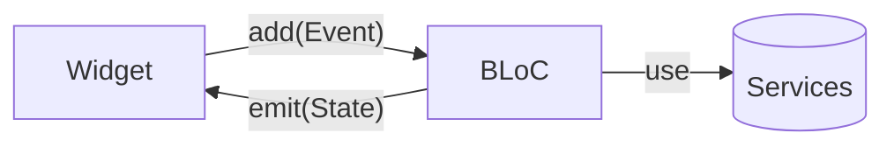
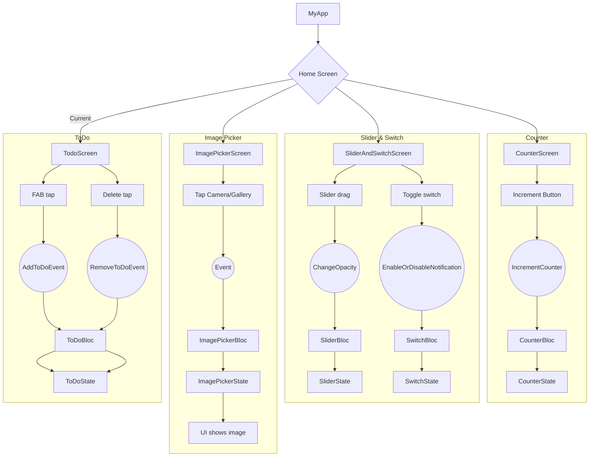

<div align="center">

# 🎯 BlocLabs — Flutter BLoC Demos


<i>A compact showcase of BLoC architecture with multiple mini-features: Counter, Slider & Switch, Image Picker, ToDo, and an Equatable comparison demo.</i>

</div>

---

## 🌈 Overview

BlocLabs demonstrates clean state management using the BLoC pattern across several independent features. Each module uses dedicated `Bloc`, `Event`, and `State` classes and a lightweight UI screen to visualize behavior.

- **Counter App**: Increment/decrement integers with `CounterBloc`.
- **Slider & Switch Demo**: Control opacity and notification toggle with two blocs and selective rebuilds.
- **Image Picker Demo**: Pick from camera or gallery via a BLoC that wraps `image_picker`.
- **ToDo App**: Add/remove in-memory tasks using `ToDoBloc`.
- **Equatable Demo**: Understand value equality vs reference equality with and without `equatable`.


## 📁 Project Structure

```text
lib/
├── main.dart                         # App entry, registers all blocs and sets home
├── counter_app/
│   ├── bloc/
│   │   ├── counter_bloc.dart         # Business logic for increment/decrement
│   │   ├── counter_event.dart        # IncrementCounter, DecrementCounter
│   │   └── counter_state.dart        # CounterState(counter)
│   └── ui/
│       └── counter_screen.dart       # UI with two buttons and live count
├── slider_and_switch_demo/
│   ├── bloc/
│   │   ├── slider/                   # SliderBloc, ChangeOpacity, SliderState
│   │   └── switch/                   # SwitchBloc, EnableOrDisableNotification, SwitchState
│   └── ui/
│       └── slider_and_switch_screen.dart
├── image_picker_demo/
│   ├── bloc/                         # ImagePickerBloc + events + state
│   ├── ui/
│   │   └── image_picker_screen.dart
│   └── utils/
│       └── image_picker_utils.dart   # Camera/Gallery wrappers
├── todo_app/
│   ├── bloc/                         # ToDoBloc + events + state
│   └── ui/
│       └── todo_screen.dart
└── equatable_demo/
    └── equatable_demo.dart           # Value vs reference equality example
```


## 🧩 Architecture & Data Flow

All features follow the same BLoC pattern:



- **Events** signal intentions from UI (e.g., `IncrementCounter`, `ChangeOpacity`).
- **Bloc** reacts to events, computes new state, and `emit`s it.
- **States** are immutable snapshots consumed by `BlocBuilder` widgets for reactive UI updates.
- **Utilities/Services** (e.g., `ImagePickerUtils`) encapsulate platform APIs and are injected into blocs.


## 🚀 App Entry and BLoC Wiring

```16:64:lib/main.dart
void main() {
  runApp(const MyApp());
}

class MyApp extends StatelessWidget {
  const MyApp({super.key});

  @override
  Widget build(BuildContext context) {
    return MultiBlocProvider(
      providers: [
        BlocProvider<CounterBloc>(create: (context) => CounterBloc()),
        BlocProvider<SwitchBloc>(create: (context) => SwitchBloc()),
        BlocProvider<SliderBloc>(create: (context) => SliderBloc()),
        BlocProvider<ImagePickerBloc>(create: (context) => ImagePickerBloc(ImagePickerUtils())),
        BlocProvider<ToDoBloc>(create: (context) => ToDoBloc()),
      ],
      child: MaterialApp(
        debugShowCheckedModeBanner: false,
        theme: ThemeData(colorScheme: ColorScheme.fromSeed(seedColor: Colors.green)),
        home: TodoScreen(),
      ),
    );
  }
}
```

- **Why MultiBlocProvider?** It provides all blocs at the root so feature screens can access them via `context.read<T>()` and `BlocBuilder<T, S>`.


## 🧮 Counter App

### Core Types

```1:18:lib/counter_app/bloc/counter_bloc.dart
class CounterBloc extends Bloc<CounterEvent, CounterState> {
  CounterBloc() : super(const CounterState()) {
    on<IncrementCounter>(_onIncrement);
    on<DecrementCounter>(_onDecrement);
  }

  void _onIncrement(IncrementCounter event, Emitter<CounterState> emit) {
    emit(state.copyWith(counter: state.counter + 1));
  }

  void _onDecrement(DecrementCounter event, Emitter<CounterState> emit) {
    emit(state.copyWith(counter: state.counter - 1));
  }
}
```

```3:14:lib/counter_app/bloc/counter_state.dart
class CounterState extends Equatable {
  final int counter;

  const CounterState({this.counter = 0});

  CounterState copyWith({int? counter}) {
    return CounterState(counter: counter ?? this.counter);
  }

  @override
  List<Object?> get props => [counter];
}
```

### UI Interaction

```20:41:lib/counter_app/ui/counter_screen.dart
BlocBuilder<CounterBloc, CounterState>(
  builder: (context, state) {
    return Text("${state.counter}", style: TextStyle(fontSize: 60));
  },
),
...
ElevatedButton.icon(
  onPressed: () => context.read<CounterBloc>().add(IncrementCounter()),
  label: Text("Increment"),
  icon: Icon(Icons.add_circle_rounded),
),
```

### Flow

- Tap button ➜ `IncrementCounter` ➜ `CounterBloc` increments ➜ emits new `CounterState` ➜ text updates.


## 🎚️ Slider & 🔔 Switch Demo

Two independent blocs drive two separate UI elements. Both use `buildWhen` to avoid unnecessary rebuilds.

```41:51:lib/slider_and_switch_demo/ui/slider_and_switch_screen.dart
BlocBuilder<SliderBloc, SliderState>(
  buildWhen: (previous, current) => previous.opacity != current.opacity,
  builder: (context, state) => Slider(
    value: state.opacity,
    onChanged: (value) => context.read<SliderBloc>().add(ChangeOpacity(opacity: value)),
  ),
),
```

```27:36:lib/slider_and_switch_demo/ui/slider_and_switch_screen.dart
BlocBuilder<SwitchBloc, SwitchState>(
  buildWhen: (previous, current) => previous.isNotification != current.isNotification,
  builder: (context, state) {
    return Switch(
      value: state.isNotification,
      onChanged: (value) => context.read<SwitchBloc>().add(EnableOrDisableNotification()),
    );
  },
),
```

### Flow

- Slide ➜ `ChangeOpacity(opacity)` ➜ `SliderBloc` emits `SliderState.opacity` ➜ container/slider reflect new value.
- Toggle switch ➜ `EnableOrDisableNotification` ➜ `SwitchBloc` flips `isNotification` ➜ switch reflects state.


## 🖼️ Image Picker Demo

The bloc delegates platform I/O to `ImagePickerUtils`, keeping the bloc pure.

```7:24:lib/image_picker_demo/bloc/image_picker_bloc.dart
class ImagePickerBloc extends Bloc<ImagePickerEvent, ImagePickerState> {
  final ImagePickerUtils utils;

  ImagePickerBloc(this.utils) : super(ImagePickerState()) {
    on<CameraCapture>(_onCameraCapture);
    on<GalleryImagePicker>(_onGalleryImagePicker);
  }

  Future<void> _onCameraCapture(CameraCapture event, Emitter<ImagePickerState> emit) async {
    XFile? file = await utils.onCameraCapture();
    emit(state.copyWith(image: file));
  }
}
```

```20:37:lib/image_picker_demo/ui/image_picker_screen.dart
return state.image == null
  ? Row(
      children: [
        InkWell(
          onTap: () => context.read<ImagePickerBloc>().add(CameraCapture()),
          child: CircleAvatar(child: Icon(Icons.camera)),
        ),
        ...
      ],
    )
  : Image.file(File(state.image!.path));
```

### Flow

- Tap camera/gallery ➜ `CameraCapture`/`GalleryImagePicker` ➜ utils picks image ➜ bloc emits `ImagePickerState(image)` ➜ UI shows selected image.


## ✅ ToDo App

`ToDoBloc` manages an in-memory list and emits new lists to trigger rebuilds.

```5:27:lib/todo_app/bloc/todo_bloc.dart
class ToDoBloc extends Bloc<ToDoEvent, ToDoState> {
  final List<String> _todos = [];

  ToDoBloc() : super(ToDoState()) {
    on<AddToDoEvent>(_onAddToDoEvent);
    on<RemoveToDoEvent>(_onRemoveToDoEvent);
  }

  void _onAddToDoEvent(AddToDoEvent event, Emitter<ToDoState> emit) {
    _todos.add(event.task);
    emit(state.copyWith(todos: List.from(_todos)));
  }
}
```

```15:41:lib/todo_app/ui/todo_screen.dart
body: BlocBuilder<ToDoBloc, ToDoState>(
  builder: (context, state) {
    if (state.todos.isEmpty) {
      return Center(child: Text("No ToDos found"));
    }
    return ListView.builder(
      itemCount: state.todos.length,
      itemBuilder: (context, index) {
        return ListTile(
          title: Text(state.todos[index]),
          trailing: IconButton(
            onPressed: () => context.read<ToDoBloc>().add(RemoveToDoEvent(task: state.todos[index])),
            icon: Icon(Icons.delete_rounded),
          ),
        );
      },
    );
  },
),
```

### Flow

- FAB tap ➜ `AddToDoEvent('Task: N')` ➜ bloc clones and emits new list ➜ list updates.
- Delete tap ➜ `RemoveToDoEvent(task)` ➜ bloc removes and emits ➜ list updates.


## 🧪 Equatable Demo

Demonstrates how `equatable` simplifies value equality.

```48:61:lib/equatable_demo/equatable_demo.dart
class Person {
  final String name;
  final int age;

  const Person({required this.name, required this.age});

  @override
  bool operator ==(Object other) =>
      identical(this, other) || other is Person && runtimeType == other.runtimeType && name == other.name && age == other.age;

  @override
  int get hashCode => name.hashCode ^ age.hashCode;
}
```

```63:72:lib/equatable_demo/equatable_demo.dart
class NewPerson extends Equatable {
  final String name;
  final int age;

  const NewPerson({required this.name, required this.age});

  @override
  List<Object?> get props => [name, age];
}
```


## 🧭 App Flow (High-level)




## 📚 Key Takeaways

- **Single-responsibility blocs** per feature keep logic isolated and testable.
- **Equatable** ensures cheap, predictable rebuilds by value-based equality on states/events.
- **Selective rebuilds** via `buildWhen` optimize UI performance.
- **Service abstraction** (`ImagePickerUtils`) keeps side-effects out of blocs.


## 🧱 Tech Stack

| Area | Tools |
|---|---|
| Framework | Flutter, Material Design |
| Language | Dart |
| State Management | `bloc`, `flutter_bloc`, `equatable` |
| Media | `image_picker` |


## 🎯 Next Ideas

- Add navigation menu to switch between all demo screens.
- Persist ToDos locally (e.g., Hive) and add unit tests.
- Extract common UI components and theme constants.

---

<sub>Made with ❤️ using BLoC pattern.</sub>

