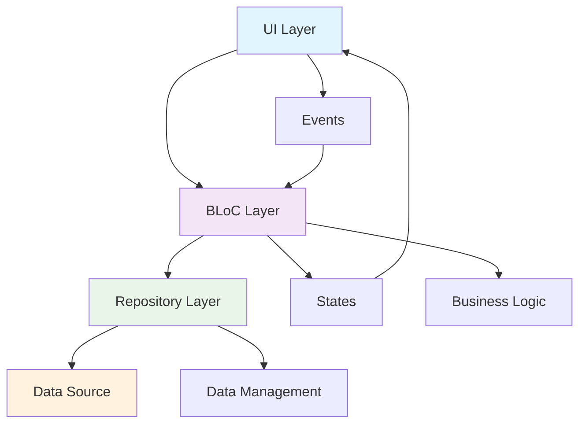
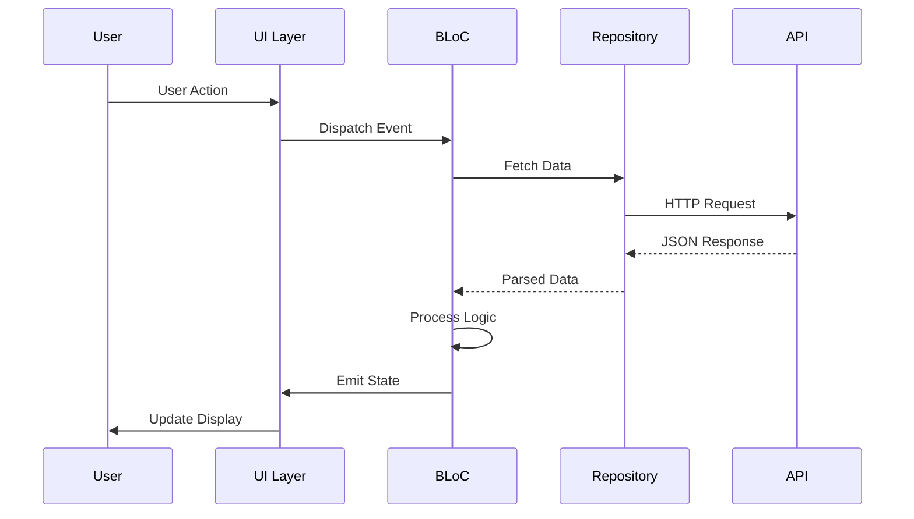
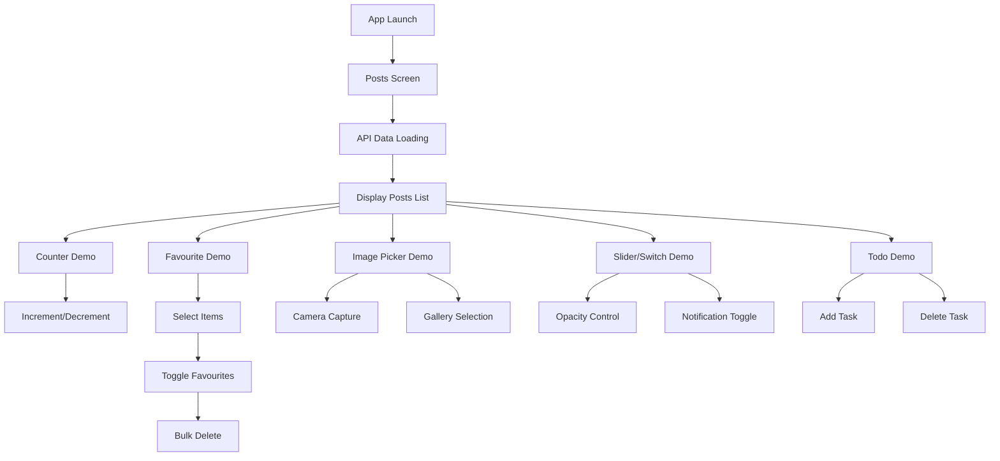

# 🚀 BlocLabs - Flutter BLoC Pattern Learning Project

<div align="center">


**A comprehensive Flutter learning project demonstrating BLoC pattern implementation with multiple real-world features**

[](#)
[](#)
[](#)

</div>

---

## 📋 Table of Contents

- [🎯 Project Overview](#-project-overview)
- [🏗️ Architecture & Structure](#️-architecture--structure)
- [✨ Features & Modules](#-features--modules)
- [🔧 Technical Implementation](#-technical-implementation)
- [📱 App Flow & User Experience](#-app-flow--user-experience)
- [🛠️ Dependencies & Technologies](#️-dependencies--technologies)
- [📊 Code Examples](#-code-examples)

---

## 🎯 Project Overview

**BlocLabs** is a comprehensive Flutter learning project that demonstrates the **BLoC (Business Logic Component)** pattern through multiple practical implementations. The project showcases various state management scenarios, from simple counter apps to complex API integrations and image handling.

### 🎨 **Key Highlights**
- **6 Complete Feature Modules** with real-world implementations
- **Clean Architecture** following BLoC pattern principles
- **Material Design 3** with dark theme implementation
- **API Integration** with JSONPlaceholder for real data fetching
- **Image Picker** functionality for camera and gallery access
- **State Management** with proper separation of concerns

---

## 🏗️ Architecture & Structure

### 📁 **Project Structure**

```
lib/
├── 📱 counter_app/              # Basic BLoC implementation
│   ├── bloc/                    # Business logic layer
│   │   ├── counter_bloc.dart    # Main BLoC class
│   │   ├── counter_event.dart   # Event definitions
│   │   └── counter_state.dart   # State management
│   └── ui/                      # Presentation layer
│       └── counter_screen.dart  # UI implementation
│
├── ❤️ favourite_app/             # Advanced list management
│   ├── bloc/                    # Complex state handling
│   ├── model/                   # Data models
│   ├── repository/              # Data layer
│   └── ui/                      # Interactive UI
│
├── 🌐 get_api_demo/             # API integration
│   ├── bloc/                    # API state management
│   ├── model/                   # JSON data models
│   ├── repository/              # HTTP client
│   ├── ui/                      # Data display
│   └── utils/                   # Helper enums
│
├── 📸 image_picker_demo/         # Media handling
│   ├── bloc/                    # Image state management
│   ├── ui/                      # Camera/Gallery UI
│   └── utils/                   # Image utilities
│
├── 🎚️ slider_and_switch_demo/    # Interactive controls
│   ├── bloc/                    # Multiple BLoCs
│   │   ├── slider/              # Slider state
│   │   └── switch/              # Switch state
│   └── ui/                      # Control interfaces
│
├── ✅ todo_app/                 # CRUD operations
│   ├── bloc/                    # Task management
│   └── ui/                      # Task interface
│
├── 🔍 equatable_demo/           # Data comparison
└── main.dart                    # App entry point
```

### 🏛️ **Architecture Pattern**



---

## ✨ Features & Modules

### 🔢 **1. Counter App** - Basic BLoC Implementation
- **Purpose**: Introduction to BLoC pattern fundamentals
- **Features**: Increment/Decrement counter with state management
- **Learning Focus**: Event handling, state emission, UI binding

```dart
// Event Definition
class IncrementCounter extends CounterEvent {}
class DecrementCounter extends CounterEvent {}

// State Management
void _onIncrement(IncrementCounter event, Emitter<CounterState> emit) {
  emit(state.copyWith(counter: state.counter + 1));
}
```

### ❤️ **2. Favourite App** - Advanced List Management
- **Purpose**: Complex state management with multiple operations
- **Features**: 
  - ✅ Item selection with checkboxes
  - ❤️ Favourite toggle functionality
  - 🗑️ Bulk delete operations
  - 📝 Visual feedback with strikethrough
- **Learning Focus**: Multi-state management, list operations, UI feedback

### 🌐 **3. API Integration** - Real Data Fetching
- **Purpose**: External data integration with error handling
- **Features**:
  - 📡 HTTP requests to JSONPlaceholder API
  - 🔄 Loading states management
  - ❌ Error handling and display
  - 📋 Dynamic list rendering
- **Learning Focus**: Async operations, error states, data parsing

```dart
// API Repository Implementation
Future<List<PostModel>> onFetchPosts() async {
  final response = await http.get(
    Uri.parse('https://jsonplaceholder.typicode.com/comments'),
    headers: {'Content-Type': 'application/json'},
  );
  
  if (response.statusCode == 200) {
    final posts = json.decode(response.body) as List;
    return posts.map((e) => PostModel.fromJson(e)).toList();
  }
  throw Exception("Error on fetching posts");
}
```

### 📸 **4. Image Picker** - Media Handling
- **Purpose**: Camera and gallery integration
- **Features**:
  - 📷 Camera capture functionality
  - 🖼️ Gallery image selection
  - 🖼️ Image preview and display
- **Learning Focus**: Platform-specific features, file handling

### 🎚️ **5. Slider & Switch** - Interactive Controls
- **Purpose**: Real-time UI updates with multiple BLoCs
- **Features**:
  - 🎚️ Opacity slider with live preview
  - 🔔 Notification toggle switch
  - 🎨 Dynamic color changes
- **Learning Focus**: Multiple BLoC coordination, real-time updates

### ✅ **6. Todo App** - CRUD Operations
- **Purpose**: Complete CRUD functionality
- **Features**:
  - ➕ Add new tasks
  - 🗑️ Delete existing tasks
  - 📋 Task list management
- **Learning Focus**: CRUD operations, list state management

### 🔍 **7. Equatable Demo** - Data Comparison
- **Purpose**: Understanding object equality
- **Features**:
  - 🔄 Manual vs automatic comparison
  - 📊 Hash code generation
  - ⚡ Performance optimization
- **Learning Focus**: Object equality, performance considerations

---

## 🔧 Technical Implementation

### 🏗️ **BLoC Pattern Implementation**

| Component | Purpose | Implementation |
|-----------|---------|----------------|
| **Events** | User actions | `abstract class CounterEvent extends Equatable` |
| **States** | UI representation | `class CounterState extends Equatable` |
| **BLoC** | Business logic | `class CounterBloc extends Bloc<Event, State>` |
| **Repository** | Data layer | `class PostRepository` |

### 🔄 **State Management Flow**



### 🎨 **UI Implementation Patterns**

#### **BlocBuilder Pattern**
```dart
BlocBuilder<CounterBloc, CounterState>(
  builder: (context, state) {
    return Text("${state.counter}", style: TextStyle(fontSize: 60));
  },
)
```

#### **Event Dispatching**
```dart
ElevatedButton.icon(
  onPressed: () => context.read<CounterBloc>().add(IncrementCounter()),
  label: Text("Increment"),
  icon: Icon(Icons.add_circle_rounded),
)
```

#### **Conditional Rendering**
```dart
BlocBuilder<FavouriteBloc, FavouriteState>(
  builder: (context, state) {
    switch (state.status) {
      case ListStatus.loading:
        return Center(child: CircularProgressIndicator());
      case ListStatus.success:
        return ListView.builder(/* ... */);
      case ListStatus.failure:
        return Center(child: Text("Something went wrong"));
    }
  },
)
```

---

## 📱 App Flow & User Experience

### 🚀 **Application Entry Point**

```dart
// MultiBlocProvider for multiple BLoCs
return MultiBlocProvider(
  providers: [
    BlocProvider<CounterBloc>(create: (context) => CounterBloc()),
    BlocProvider<SwitchBloc>(create: (context) => SwitchBloc()),
    BlocProvider<SliderBloc>(create: (context) => SliderBloc()),
    BlocProvider<ImagePickerBloc>(create: (context) => ImagePickerBloc(ImagePickerUtils())),
    BlocProvider<ToDoBloc>(create: (context) => ToDoBloc()),
    BlocProvider<FavouriteBloc>(create: (context) => FavouriteBloc(FavouriteRepository())),
    BlocProvider<PostsBloc>(create: (context) => PostsBloc()),
  ],
  child: MaterialApp(
    debugShowCheckedModeBanner: false,
    theme: ThemeData(useMaterial3: true, brightness: Brightness.dark),
    home: PostsScreen(),
  ),
);
```

### 🎯 **User Interaction Flow**



### 🎨 **Visual Design System**

- **Theme**: Material Design 3 with Dark Mode
- **Colors**: Dynamic color scheme with opacity controls
- **Typography**: Consistent text styling across modules
- **Icons**: Material Design icons for intuitive navigation
- **Layout**: Responsive design with proper spacing

---

## 🛠️ Dependencies & Technologies

### 📦 **Core Dependencies**

| Package | Version | Purpose |
|---------|---------|---------|
| `flutter_bloc` | ^9.1.1 | BLoC state management |
| `bloc` | ^9.0.1 | Core BLoC functionality |
| `equatable` | ^2.0.7 | Object equality comparison |
| `http` | ^1.5.0 | API communication |
| `image_picker` | ^1.2.0 | Camera and gallery access |

### 🔧 **Development Dependencies**

| Package | Version | Purpose |
|---------|---------|---------|
| `flutter_lints` | ^5.0.0 | Code quality and linting |
| `flutter_test` | SDK | Unit and widget testing |

### 🏗️ **Architecture Benefits**

- ✅ **Separation of Concerns**: Clear separation between UI, business logic, and data
- ✅ **Testability**: Easy unit testing of business logic
- ✅ **Maintainability**: Modular code structure
- ✅ **Scalability**: Easy to add new features
- ✅ **Reusability**: BLoC components can be reused across screens

---

## 📊 Code Examples

### 🔄 **Complete BLoC Implementation**

```dart
// Event Definition
abstract class CounterEvent extends Equatable {
  const CounterEvent();
  @override
  List<Object?> get props => [];
}

class IncrementCounter extends CounterEvent {}
class DecrementCounter extends CounterEvent {}

// State Definition
class CounterState extends Equatable {
  final int counter;
  const CounterState({this.counter = 0});
  
  CounterState copyWith({int? counter}) {
    return CounterState(counter: counter ?? this.counter);
  }
  
  @override
  List<Object?> get props => [counter];
}

// BLoC Implementation
class CounterBloc extends Bloc<CounterEvent, CounterState> {
  CounterBloc() : super(const CounterState()) {
    on<IncrementCounter>(_onIncrement);
    on<DecrementCounter>(_onDecrement);
  }

  void _onIncrement(IncrementCounter event, Emitter<CounterState> emit) {
    emit(state.copyWith(counter: state.counter + 1));
  }

  void _onDecrement(DecrementCounter event, Emitter<CounterState> emit) {
    emit(state.copyWith(counter: state.counter - 1));
  }
}
```

### 🎨 **UI Integration**

```dart
class CounterScreen extends StatelessWidget {
  @override
  Widget build(BuildContext context) {
    return Scaffold(
      appBar: AppBar(title: Text("Counter App Demo")),
      body: Center(
        child: Column(
          mainAxisAlignment: MainAxisAlignment.center,
          children: [
            BlocBuilder<CounterBloc, CounterState>(
              builder: (context, state) {
                return Text("${state.counter}", style: TextStyle(fontSize: 60));
              },
            ),
            Row(
              mainAxisAlignment: MainAxisAlignment.center,
              children: [
                ElevatedButton.icon(
                  onPressed: () => context.read<CounterBloc>().add(IncrementCounter()),
                  label: Text("Increment"),
                  icon: Icon(Icons.add_circle_rounded),
                ),
                SizedBox(width: 20),
                ElevatedButton.icon(
                  onPressed: () => context.read<CounterBloc>().add(DecrementCounter()),
                  label: Text("Decrement"),
                  icon: Icon(Icons.remove_circle_rounded),
                ),
              ],
            ),
          ],
        ),
      ),
    );
  }
}
```

---

## 🎯 **Learning Outcomes**

This project demonstrates mastery of:

- ✅ **BLoC Pattern**: Complete understanding of event-driven state management
- ✅ **Flutter Architecture**: Clean separation of concerns
- ✅ **State Management**: Complex state handling scenarios
- ✅ **API Integration**: Real-world data fetching and error handling
- ✅ **UI/UX Design**: Material Design 3 implementation
- ✅ **Code Organization**: Modular and maintainable code structure

---

<div align="center">

**🚀 Ready to explore the world of Flutter BLoC pattern!**

*This project serves as a comprehensive learning resource for Flutter developers looking to master the BLoC pattern and state management.*

</div>
