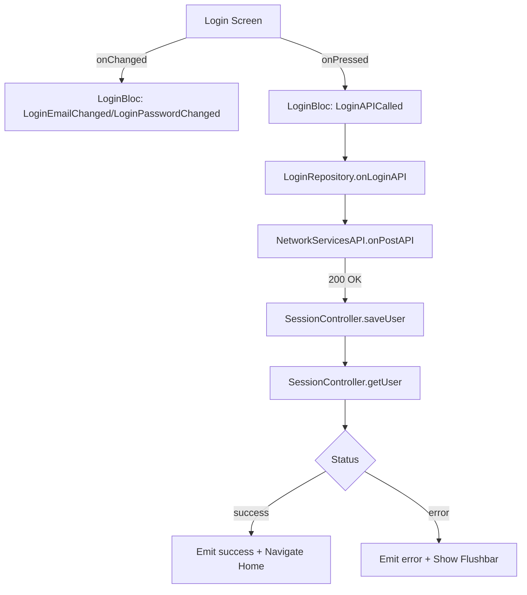
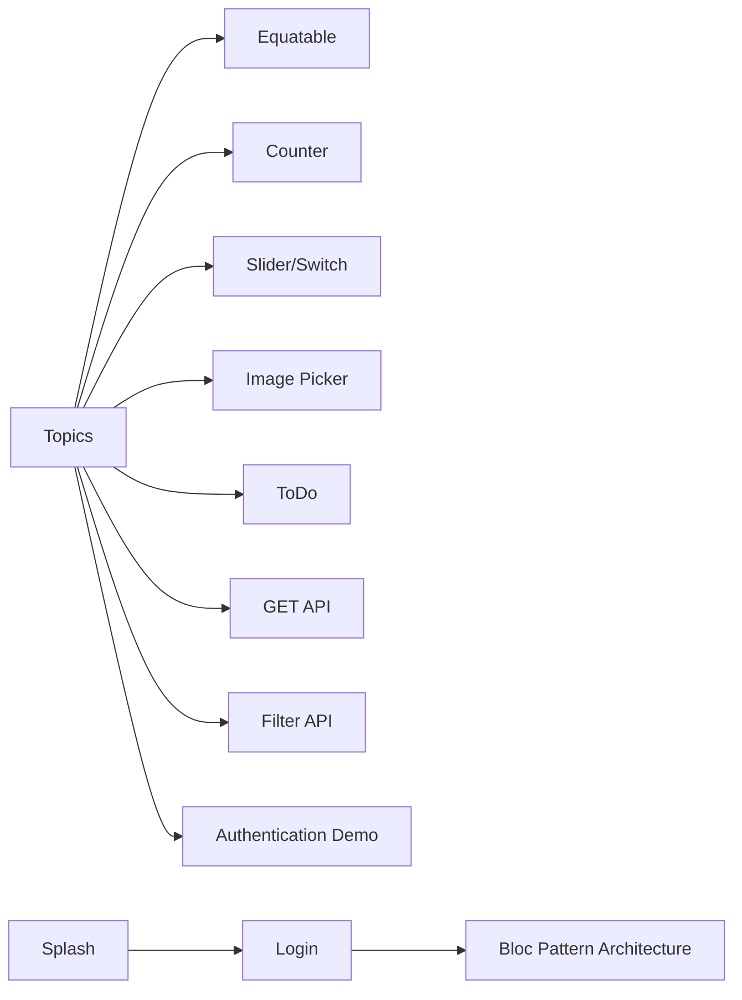

## BlocLabs — Flutter BLoC Showcase 🚀

[](https://flutter.dev)
[](https://dart.dev)
[](https://bloclibrary.dev)
[](https://pub.dev/packages/get_it)
[](https://pub.dev/packages/freezed)
[](https://pub.dev/packages/http)
[](https://pub.dev/packages/image_picker)
[](https://pub.dev/packages/flutter_secure_storage)
[](https://pub.dev/packages/cached_network_image)
[](https://pub.dev/packages/another_flushbar)

### ✨ Overview
BlocLabs is a multi-demo Flutter application showcasing production-grade BLoC architecture patterns and feature modules:
- Counter, Slider & Switch demos for state basics
- Image picking (camera/gallery) with BLoC
- ToDo list with list diffing patterns
- API demos (GET and filter)
- Authentication flows (standalone and within a layered architecture)
- An opinionated “Bloc Pattern Architecture” module with DI, repositories, models, services, and views

---

## 🗂 Architecture & Folder Map

### High-level
- `lib/` — application code
  - `authentication_app/` — minimal login BLoC demo
  - `bloc_pattern_architecture/` — layered architecture sample (DI, repos, services, models, views)
  - Feature demos: `counter_app/`, `slider_and_switch_demo/`, `image_picker_demo/`, `todo_app/`, `get_api_demo/`, `filter_api_list_demo/`, `equatable_demo/`
  - `main.dart` — app entry, DI via `GetIt`, multi-bloc providers
  - `topics.dart` — launcher screen to navigate to feature demos

### Bloc Pattern Architecture layout
```12:23:lib/bloc_pattern_architecture/ARCHITECTURE.md
lib/
├── bloc/
├── config/
│   ├── color/
│   ├── components/
│   ├── routes/
│   └── themes/
├── data/
│   ├── exception/
│   ├── network/
│   └── response/
├── l10n/
├── models/
├── repository/
├── services/
│   ├── session_manager/
│   └── storage/
├── utils/
│   └── extensions/
├── views/
└── main.dart
```

---

## 🧠 Core Composition

### Entry point, DI, and App shell
```58:76:lib/main.dart
    return MultiBlocProvider(
      providers: [
        BlocProvider<SwitchBloc>(create: (context) => SwitchBloc()),
        BlocProvider<SliderBloc>(create: (context) => SliderBloc()),
        BlocProvider<ImagePickerBloc>(create: (context) => ImagePickerBloc(ImagePickerUtils())),
        BlocProvider<ToDoBloc>(create: (context) => ToDoBloc()),
        BlocProvider<FavouriteBloc>(create: (context) => FavouriteBloc(FavouriteRepository())),
        BlocProvider<PostsBloc>(create: (context) => PostsBloc()),
        BlocProvider<FilterPostsBloc>(create: (context) => FilterPostsBloc()),
      ],
      child: MaterialApp(
        debugShowCheckedModeBanner: false,
        theme: ThemeData(useMaterial3: true, brightness: Brightness.dark),
        home: Topics(),
        onGenerateRoute: AppRoutes.generateRoute,
      ),
    );
```

### App routing (Bloc Pattern Architecture module)
```6:21:lib/bloc_pattern_architecture/config/routes/app_routes.dart
class AppRoutes {
  static Route<dynamic> generateRoute(RouteSettings settings) {
    switch (settings.name) {
      case RoutesName.splash:
        return MaterialPageRoute(builder: (context) => SplashScreen());
      case RoutesName.login:
        return MaterialPageRoute(builder: (context) => LoginScreen());
      case RoutesName.home:
        return MaterialPageRoute(builder: (context) => HomeScreen());
      default:
        return MaterialPageRoute(
          builder: (context) => Scaffold(body: Center(child: Text("No Route found."))),
        );
    }
  }
}
```

---

## 🧩 Features, BLoCs, and Data Flow

### Feature Matrix
- **Counter App**: Increment/decrement via `CounterBloc`
- **Slider & Switch**: UI controls with `SliderBloc` and `SwitchBloc`
- **Image Picker**: Camera/Gallery with `ImagePickerBloc` + `image_picker`
- **ToDo App**: Add/remove tasks via `ToDoBloc`
- **GET API Demo**: Fetch and render list via `PostsBloc` + `http`
- **Filter API Demo**: Fetch, search client-side via `FilterPostsBloc`
- **Authentication Demo**: Minimal login flow using `LoginBloc` (standalone)
- **Bloc Pattern Architecture**:
  - Login through repository (reqres.in)
  - Persist session to secure storage
  - Movie list via repository and `cached_network_image`
  - Reusable components for loading/errors

### Key BLoC handlers (selected)
- Movie fetching
```18:26:lib/bloc_pattern_architecture/bloc/movie/movie_bloc.dart
  void _onMovieFetched(MovieFetched event, Emitter<MovieState> emit) async {
    await repo
        .fetchMovies()
        .then((value) {
          emit(state.copyWith(movies: APIResponse.completed(value)));
        })
        .onError((error, stackTrace) {
          emit(state.copyWith(movies: APIResponse.error(error.toString())));
        });
  }
```

- Layered login (repo + session)
```31:43:lib/bloc_pattern_architecture/bloc/login/login_bloc.dart
  void _onLoginAPICalled(LoginAPICalled event, Emitter<LoginState> emit) async {
    Map<String, dynamic> credential = {'email': state.email.trim(), 'password': state.password.trim()};
    emit(state.copyWith(status: LoginStatus.loading));
    await repo
        .onLoginAPI(credential)
        .then((value) async {
          if (value.error.isNotEmpty) {
            emit(state.copyWith(message: value.error, status: LoginStatus.error));
          } else {
            await SessionController().saveUserInPreference(value);
            await SessionController().getUserFromPreference();
            emit(state.copyWith(message: "Login Successful : ${value.token}", status: LoginStatus.success));
          }
        })
        .onError((error, stackTrace) {
          emit(state.copyWith(message: error.toString(), status: LoginStatus.error));
        });
  }
```

- Networking service wrapper (timeouts, mapping)
```40:54:lib/bloc_pattern_architecture/config/data/network/network_services_api.dart
  Future<dynamic> onPostAPI(String url, data) async {
    dynamic json_response;
    try {
      final response = await http
          .post(Uri.parse(url), body: data, headers: {'x-api-key': 'reqres-free-v1'})
          .timeout(const Duration(seconds: 60));
      json_response = onReturnResponse(response);
    } on SocketException {
      throw NoInternetException('');
    } on TimeoutException {
      throw RequestTimeoutException('');
    }
    log("${json_response}", name: "Response");
    return json_response;
  }
```

- Home list rendering with logout (clears secure storage)
```56:73:lib/bloc_pattern_architecture/views/home/home_screen.dart
        body: BlocProvider<MovieBloc>(
          create: (context) => _bloc..add(MovieFetched()),
          child: BlocBuilder<MovieBloc, MovieState>(
            builder: (context, state) {
              switch (state.movies.status) {
                case Status.loading:
                  return Center(child: CircularProgressIndicator());
                case Status.completed:
                  if (state.movies.data == null) {
                    return Center(child: Text("No Data Found"));
                  }
                  return ListView.builder(
                    itemCount: state.movies.data!.tv_shows.length,
                    itemBuilder: (context, index) {
                      final Shows movie = state.movies.data!.tv_shows[index];
                      return Card(
                        child: ListTile(
                          leading: CachedNetworkImage(
```

- Session persistence
```20:37:lib/bloc_pattern_architecture/services/session_manager/session_controller.dart
  Future<void> saveUserInPreference(dynamic user) async {
    storage.setValue('token', jsonEncode(user));
    storage.setValue('isLogin', 'true');
  }

  Future<void> getUserFromPreference() async {
    try {
      var user_data = await storage.getValue('token');
      var isLoggedIn = await storage.getValue('isLogin');

      if (user_data!.isNotEmpty) {
        SessionController().user = UserModel.fromJson(jsonDecode(user_data));
      }
      SessionController().isLoggedIn = isLoggedIn == 'true' ? true : false;
    } catch (e) {
      log("$e", name: "Storage Read Error");
    }
  }
```

---

## 🔗 Data & Control Flow

### App shell & navigation (Topics → Feature screens)
- `Topics` screen offers quick navigation to each demo.
- `onGenerateRoute` handles routes for the architecture module.

### Authentication (Bloc Pattern Architecture)
- UI widgets (`EmailInputWidget`, `PasswordInputWidget`, `LoginButton`) dispatch events.
- `LoginBloc` uses `LoginRepository` to call `NetworkServicesAPI` → `AppURLs.login`.
- On success, `SessionController` persists to `flutter_secure_storage`, then navigates to `home`.

Mermaid flow (app-level login)


### Movies list (Bloc Pattern Architecture)
- `HomeScreen` creates `MovieBloc(repo: getIt())` and fires `MovieFetched`.
- Repository hits `AppURLs.popular_movies` via `GET`, transforms to `Movie` model, page renders with `CachedNetworkImage`.

### GET API Demo
- `PostsBloc` fetches comments from JSONPlaceholder and renders simple list.

### Filter API Demo
- Fetch once, filter in-memory on input:
```29:38:lib/filter_api_list_demo/bloc/filter_posts_bloc.dart
  void onSearchItem(SearchItem event, Emitter<FilterPostsState> emit) {
    if (event.item.isEmpty) {
      emit(state.copyWith(temp_posts: [], search_message: ''));
    } else {
      temp_posts = state.posts.where((e) => e.email.toString().toLowerCase().contains(event.item.toLowerCase())).toList();
      if (temp_posts.isEmpty) {
        emit(state.copyWith(temp_posts: temp_posts, search_message: "No data found"));
      } else {
        emit(state.copyWith(temp_posts: temp_posts, search_message: ''));
      }
    }
  }
```

### Image Picker Demo
- Camera/Gallery dispatches events to `ImagePickerBloc`, UI rebuilds with selected image preview.
```15:23:lib/image_picker_demo/bloc/image_picker_bloc.dart
  Future<void> _onCameraCapture(CameraCapture event, Emitter<ImagePickerState> emit) async {
    XFile? file = await utils.onCameraCapture();
    emit(state.copyWith(image: file));
  }

  Future<void> _onGalleryImagePicker(GalleryImagePicker event, Emitter<ImagePickerState> emit) async {
    XFile? file = await utils.onPickFromGallery();
    emit(state.copyWith(image: file));
  }
```

### ToDo App
```13:21:lib/todo_app/bloc/todo_bloc.dart
  void _onAddToDoEvent(AddToDoEvent event, Emitter<ToDoState> emit) {
    _todos.add(event.task);
    emit(state.copyWith(todos: List.from(_todos)));
  }
```
```23:26:lib/todo_app/bloc/todo_bloc.dart
  void _onRemoveToDoEvent(RemoveToDoEvent event, Emitter<ToDoState> emit) {
    _todos.remove(event.task);
    emit(state.copyWith(todos: List.from(_todos)));
  }
```

### Favourite App
- Select/unselect, delete in bulk, and toggle “favourite” icon.
```47:51:lib/favourite_app/bloc/favourite_bloc.dart
  void _onDeleteItems(DeleteItem event, Emitter<FavouriteState> emit) {
    items.removeWhere((e) => temp_items.contains(e));
    temp_items.clear();
    emit(state.copyWith(items: List.from(items), temp_items: List.from(temp_items)));
  }
```

---

## 🧭 Visual App Flow (Top-level)



---

## 🏗️ Important Types & Utilities

- `APIResponse<T>`: Loading/Completed/Error wrapper for async UI states.
```3:15:lib/bloc_pattern_architecture/config/data/response/api_response.dart
class APIResponse<T> {
  Status? status;
  T? data;
  String? message;

  APIResponse(this.status, this.data, this.message);
  APIResponse.loading() : status = Status.loading;
  APIResponse.completed(this.data) : status = Status.completed;
  APIResponse.error(this.message) : status = Status.error;
```

- `Validations.emailValidator` used in login inputs.
- `FlushBarHelper` to show success/error floating bars.
- `LocalStorage` wraps `flutter_secure_storage` read/write/clear.

---

## 📦 Dependencies in Use

| Area | Package | Purpose |
|---|---|---|
| State Mgmt | `bloc`, `flutter_bloc` | BLoC pattern and bindings |
| DI | `get_it` | Repository and service resolution |
| Networking | `http` | REST calls |
| Models | `freezed`, `json_annotation` | Data classes + JSON |
| Storage | `flutter_secure_storage` | Encrypted key/value |
| UI | `cached_network_image`, `another_flushbar`, `google_fonts` | Imagery, feedback, typography |
| Media | `image_picker` | Camera/Gallery selection |

---

## 🔍 Notable Modules

- `authentication_app/`: Minimal login with direct `http` call and `SnackBar` feedback.
- `bloc_pattern_architecture/`: Full stack (routes, repos, services, models) with session and movie list.
- `get_api_demo/`, `filter_api_list_demo/`: API + search demos against JSONPlaceholder.
- `image_picker_demo/`: Platform media capture/pick.
- `slider_and_switch_demo/`, `counter_app/`, `todo_app/`: Clean examples for BLoC patterns and UI updates.

---

## 🧪 Selected Code References

- Route names constants
```1:5:lib/bloc_pattern_architecture/config/routes/routes_name.dart
class RoutesName {
  static const String splash = "splash";
  static const String login = "login";
  static const String home = "home";
}
```

- Rendering movie rows with cached images
```68:90:lib/bloc_pattern_architecture/views/home/home_screen.dart
                  return ListView.builder(
                    itemCount: state.movies.data!.tv_shows.length,
                    itemBuilder: (context, index) {
                      final Shows movie = state.movies.data!.tv_shows[index];
                      return Card(
                        child: ListTile(
                          leading: CachedNetworkImage(
                            imageUrl: movie.image_thumbnail_path,
                            useOldImageOnUrlChange: true,
                            height: 50,
                            width: 50,
                            errorWidget: (context, url, error) => SizedBox(),
```

---

## 📱 UX Notes
- Consistent Material 3 dark theme.
- SnackBars for quick feedback, Flushbar for rich toasts (architecture login).
- Error and loading components for resilient networking.

---

## 🧩 Extending the Project
- Add more repositories under `repository/` and wire them through `getIt` in `servicesLocator()`.
- Model new screens under `views/` and add typed routes in `config/routes/`.
- Reuse `APIResponse<T>` with your own BLoCs for clean async UI states.

---

## 🗒️ Credits
- Public APIs: `reqres.in`, `jsonplaceholder.typicode.com`
- TV shows endpoint: `episodate.com`

Enjoy exploring and extending BlocLabs! 🎉

