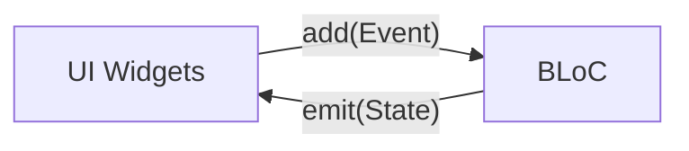
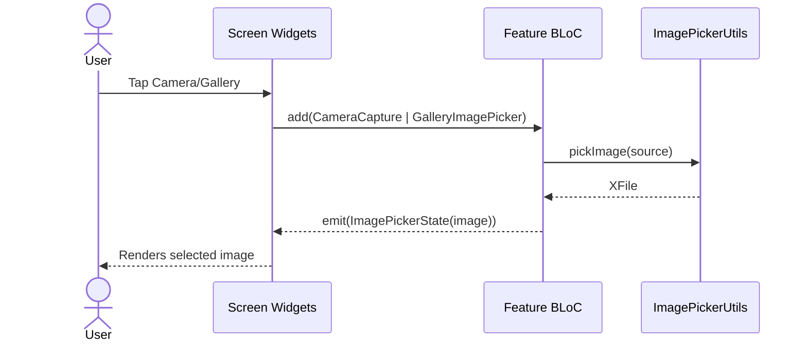

# 🎯 BlocLabs — Flutter + BLoC Showcase

> A concise, example-driven Flutter project demonstrating state management with BLoC, equality with Equatable, media selection with Image Picker, and reactive UI using Flutter widgets.

---

## ✨ Badges


> Dependencies from `pubspec.yaml`: `bloc`, `flutter_bloc`, `equatable`, `image_picker`, `cupertino_icons`.

---

## 🧭 Overview

BlocLabs is a learning/demo app that bundles multiple independent examples:
- 🧮 Counter with BLoC
- 🧰 Equatable demo (value equality)
- 🎚️ Slider + 🔔 Switch with BLoC (controlled rebuilds via `buildWhen`)
- 🖼️ Image Picker with BLoC (camera/gallery)

The app bootstraps multiple BLoCs using `MultiBlocProvider` and wires screens with reactive `BlocBuilder` widgets.

---

## 📂 Architecture & Folder Structure

```text
lib/
├─ main.dart                      # App entry, MultiBlocProvider, theme, initial route
├─ counter_app/
│  ├─ bloc/
│  │  ├─ counter_bloc.dart       # Business logic: increment/decrement
│  │  ├─ counter_event.dart      # Events: IncrementCounter, DecrementCounter
│  │  └─ counter_state.dart      # State: counter value + copyWith
│  └─ ui/
│     └─ counter_screen.dart     # UI: buttons dispatch events, show state
├─ equatable_demo/
│  └─ equatable_demo.dart        # Equatable vs manual equality demo
├─ image_picker_demo/
│  ├─ bloc/
│  │  ├─ image_picker_bloc.dart  # Camera/Gallery handlers → emits XFile
│  │  ├─ image_picker_event.dart # Events: CameraCapture, GalleryImagePicker
│  │  └─ image_picker_state.dart # State: selected image (XFile?)
│  ├─ ui/
│  │  └─ image_picker_screen.dart# UI for camera/gallery + preview
│  └─ utils/
│     └─ image_picker_utils.dart # Thin wrapper around ImagePicker
└─ slider_and_switch_demo/
   ├─ bloc/
   │  ├─ slider/                 # Slider opacity feature
   │  │  ├─ slider_bloc.dart
   │  │  ├─ slider_event.dart
   │  │  └─ slider_state.dart
   │  └─ switch/                 # Notification toggle feature
   │     ├─ switch_bloc.dart
   │     ├─ switch_event.dart
   │     └─ switch_state.dart
   └─ ui/
      └─ slider_and_switch_screen.dart
```

---

## 🧱 Core Modules & Responsibilities

- **main.dart**: wires up `MultiBlocProvider` with `CounterBloc`, `SwitchBloc`, `SliderBloc`, `ImagePickerBloc` and sets the `home` screen.
- **Counter Module**: showcases simple event-driven state changes via `CounterBloc`.
- **Slider & Switch Module**: demonstrates multiple BLoCs in one screen with selective rebuilds using `buildWhen`.
- **Image Picker Module**: abstracts media access through `ImagePickerUtils` and exposes a clean BLoC interface for UI.
- **Equatable Demo**: contrasts manual equality vs `Equatable`-powered equality.

---

## 🔌 Data Flow (BLoC Pattern)

1. UI dispatches an **Event** to a **Bloc** (`context.read<Bloc>().add(Event())`).
2. **Bloc** handles the event, computes new **State**.
3. `BlocBuilder` rebuilds on state changes and renders.



---

## 🧮 Counter Feature

- **Events**: `IncrementCounter`, `DecrementCounter`
- **State**: `CounterState(counter: int)` with `copyWith`
- **Bloc**: updates counter on events

```20:33:lib/counter_app/bloc/counter_bloc.dart
class CounterBloc extends Bloc<CounterEvent, CounterState> {
  CounterBloc() : super(const CounterState()) {
    on<IncrementCounter>(_onIncrement);
    on<DecrementCounter>(_onDecrement);
  }

  void _onIncrement(IncrementCounter event, Emitter<CounterState> emit) {
    emit(state.copyWith(counter: state.counter + 1));
  }
}
```

```20:41:lib/counter_app/ui/counter_screen.dart
ElevatedButton.icon(
  onPressed: () => context.read<CounterBloc>().add(IncrementCounter()),
  label: Text("Increment"),
  icon: Icon(Icons.add_circle_rounded),
)
```

---

## 🎚️ Slider + 🔔 Switch Feature

- **SwitchBloc** toggles `isNotification`.
- **SliderBloc** adjusts `opacity` for a colored container.
- Uses `buildWhen` to avoid unnecessary rebuilds.

```28:36:lib/slider_and_switch_demo/ui/slider_and_switch_screen.dart
BlocBuilder<SwitchBloc, SwitchState>(
  buildWhen: (previous, current) => previous.isNotification != current.isNotification,
  builder: (context, state) {
    return Switch(
      value: state.isNotification,
      onChanged: (value) => context.read<SwitchBloc>().add(EnableOrDisableNotification()),
    );
  },
)
```

```41:51:lib/slider_and_switch_demo/ui/slider_and_switch_screen.dart
BlocBuilder<SliderBloc, SliderState>(
  buildWhen: (previous, current) => previous.opacity != current.opacity,
  builder: (context, state) => Slider(
    value: state.opacity,
    onChanged: (value) => context.read<SliderBloc>().add(ChangeOpacity(opacity: value)),
  ),
)
```

---

## 🖼️ Image Picker Feature

- **Events**: `CameraCapture`, `GalleryImagePicker`
- **State**: `ImagePickerState(image: XFile?)`
- **Bloc**: calls `ImagePickerUtils` to pick/capture, then emits file

```15:23:lib/image_picker_demo/bloc/image_picker_bloc.dart
Future<void> _onGalleryImagePicker(GalleryImagePicker event, Emitter<ImagePickerState> emit) async {
  XFile? file = await utils.onPickFromGallery();
  emit(state.copyWith(image: file));
}
```

```26:37:lib/image_picker_demo/ui/image_picker_screen.dart
InkWell(
  onTap: () => context.read<ImagePickerBloc>().add(GalleryImagePicker()),
  child: CircleAvatar(child: Icon(Icons.photo_library_rounded)),
)
```

---

## 🧰 Equatable Demo

- Shows difference between manual equality and `Equatable`.

```63:72:lib/equatable_demo/equatable_demo.dart
class NewPerson extends Equatable {
  final String name;
  final int age;

  const NewPerson({required this.name, required this.age});

  @override
  List<Object?> get props => [name, age];
}
```

---

## 🧩 Composition & App Wiring

```46:59:lib/main.dart
return MultiBlocProvider(
  providers: [
    BlocProvider<CounterBloc>(create: (context) => CounterBloc()),
    BlocProvider<SwitchBloc>(create: (context) => SwitchBloc()),
    BlocProvider<SliderBloc>(create: (context) => SliderBloc()),
    BlocProvider<ImagePickerBloc>(create: (context) => ImagePickerBloc(ImagePickerUtils())),
  ],
  child: MaterialApp(
    debugShowCheckedModeBanner: false,
    theme: ThemeData(colorScheme: ColorScheme.fromSeed(seedColor: Colors.green)),
    home: ImagePickerScreen(),
  ),
);
```

- **Home Screen**: currently `ImagePickerScreen`.
- Replace `home` with `CounterScreen` or `SliderAndSwitchScreen` to explore other demos.

---

## 🔄 Interaction Flow (Visual)



---

## 📑 Reference Table of Key Types

| Area | File | Types | Purpose |
|------|------|-------|---------|
| App | `lib/main.dart` | `MyApp` | BLoC providers and app theme/home |
| Counter | `counter_bloc.dart` | `CounterBloc` | Business logic for counter |
| Counter | `counter_event.dart` | `IncrementCounter`, `DecrementCounter` | User intents |
| Counter | `counter_state.dart` | `CounterState` | Counter value snapshot |
| Slider | `slider_bloc.dart` | `SliderBloc` | Opacity control |
| Slider | `slider_event.dart` | `ChangeOpacity` | New opacity value |
| Slider | `slider_state.dart` | `SliderState` | Holds current opacity |
| Switch | `switch_bloc.dart` | `SwitchBloc` | Notification toggle |
| Switch | `switch_event.dart` | `EnableOrDisableNotification` | Toggle intent |
| Switch | `switch_state.dart` | `SwitchState` | Holds toggle state |
| Image Picker | `image_picker_bloc.dart` | `ImagePickerBloc` | Picks/captures image |
| Image Picker | `image_picker_event.dart` | `CameraCapture`, `GalleryImagePicker` | Source selection |
| Image Picker | `image_picker_state.dart` | `ImagePickerState` | Holds `XFile?` |
| Image Picker | `image_picker_utils.dart` | `ImagePickerUtils` | Thin wrapper around `ImagePicker` |
| Equatable | `equatable_demo.dart` | `Person`, `NewPerson` | Equality demo |

---

## 🧠 Notable Techniques

- **`buildWhen`**: minimizes rebuilds in `SliderAndSwitchScreen`.
- **`copyWith`** patterns: safe immutable updates across states.
- **Separation of concerns**: UI ↔ Events/States ↔ Bloc ↔ Utils.
- **Constructor injection**: `ImagePickerBloc(ImagePickerUtils())` enables testing/mocking.

---

## ✅ How to Explore Demos Quickly

- Set different home screens in `lib/main.dart`:
  - `home: CounterScreen()`
  - `home: SliderAndSwitchScreen()`
  - `home: ImagePickerScreen()` (default)
  - `home: EquatableDemoScreen()`

---

## 📌 Notes

- Project targets Dart SDK `^3.9.2` and uses modern Flutter APIs.
- Android/iOS scaffolding and assets are standard Flutter template outputs.

---

Made with ❤️ using Flutter and BLoC.

