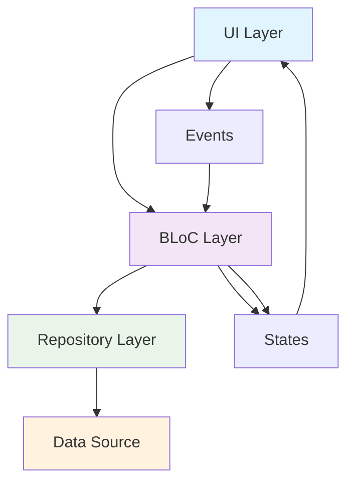
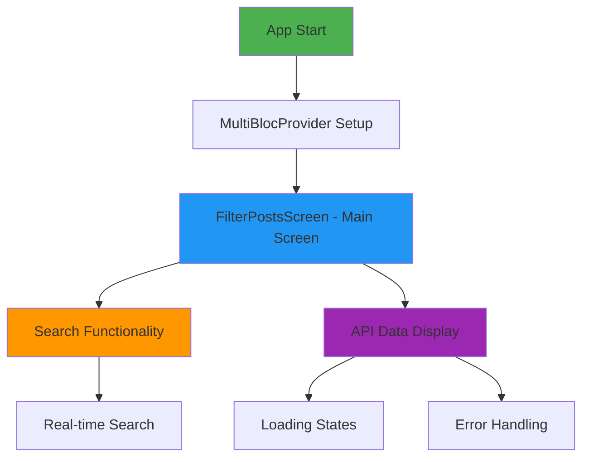
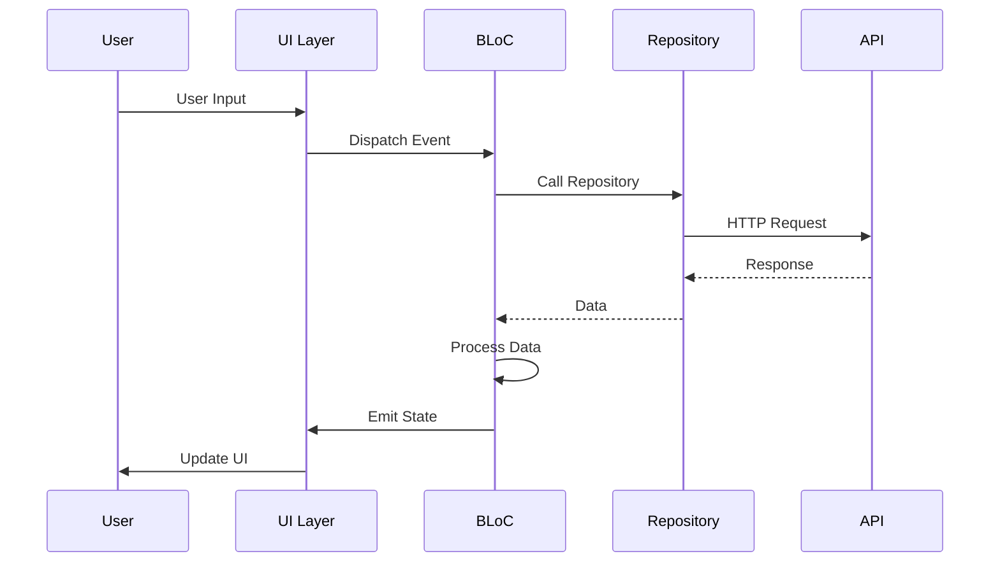
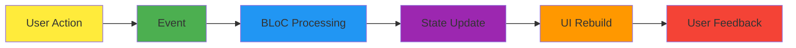

# 🚀 BlocLabs - Flutter BLoC Pattern Learning Project

<div align="center">


**A comprehensive Flutter learning project demonstrating BLoC pattern implementation with multiple real-world examples**

[](#)
[](#)
[](#)

</div>

---

## 📋 Table of Contents

- [🎯 Project Overview](#-project-overview)
- [🏗️ Architecture & Structure](#️-architecture--structure)
- [✨ Features & Demo Apps](#-features--demo-apps)
- [📱 App Flow & Navigation](#-app-flow--navigation)
- [🔧 Technical Implementation](#-technical-implementation)
- [📊 Data Flow Diagrams](#-data-flow-diagrams)
- [💻 Code Examples](#-code-examples)
- [🛠️ Dependencies](#️-dependencies)

---

## 🎯 Project Overview

**BlocLabs** is a comprehensive Flutter learning project that demonstrates the **BLoC (Business Logic Component)** pattern through 8 different real-world scenarios. Each demo showcases different aspects of state management, API integration, and user interactions using the BLoC pattern.

### 🎨 **Key Highlights**
- **8 Complete Demo Applications** with different use cases
- **Clean Architecture** following BLoC pattern principles
- **Real API Integration** with JSONPlaceholder API
- **Advanced State Management** with proper error handling
- **Material Design 3** with dark theme support
- **Comprehensive Examples** from basic counter to complex filtering

---

## 🏗️ Architecture & Structure

### 📁 **Project Structure**

```
lib/
├── 📱 counter_app/                    # Basic Counter Demo
│   ├── bloc/                         # BLoC Implementation
│   │   ├── counter_bloc.dart         # Business Logic
│   │   ├── counter_event.dart        # Events
│   │   └── counter_state.dart        # States
│   └── ui/
│       └── counter_screen.dart       # UI Layer
│
├── ❤️ favourite_app/                 # Favorites Management
│   ├── bloc/                         # BLoC + Repository Pattern
│   ├── model/                        # Data Models
│   ├── repository/                   # Data Layer
│   └── ui/
│
├── 🔍 filter_api_list_demo/         # API + Search Functionality
│   ├── bloc/                         # Complex State Management
│   ├── model/                        # API Models
│   ├── repository/                   # API Repository
│   ├── utils/                        # Enums & Utilities
│   └── ui/
│
├── 📡 get_api_demo/                  # API Integration
│   ├── bloc/                         # HTTP BLoC
│   ├── model/                        # Post Models
│   ├── repository/                   # API Calls
│   ├── utils/                        # Status Enums
│   └── ui/
│
├── 📸 image_picker_demo/            # Device Integration
│   ├── bloc/                         # Image Picker BLoC
│   ├── utils/                        # Image Utilities
│   └── ui/
│
├── 🎚️ slider_and_switch_demo/       # UI Controls
│   ├── bloc/                         # Multiple BLoCs
│   │   ├── slider/                   # Slider BLoC
│   │   └── switch/                   # Switch BLoC
│   └── ui/
│
├── ✅ todo_app/                     # CRUD Operations
│   ├── bloc/                         # Todo Management
│   └── ui/
│
├── 🔧 equatable_demo/               # Equatable Package Demo
└── main.dart                        # App Entry Point
```

### 🏛️ **BLoC Architecture Pattern**



---

## ✨ Features & Demo Apps

### 🎯 **1. Counter App** - *Basic BLoC Implementation*
- **Purpose**: Introduction to BLoC pattern
- **Features**: Increment/Decrement counter
- **Learning**: Basic state management, events, and states

### ❤️ **2. Favorites App** - *Complex State Management*
- **Purpose**: Multi-item selection and favorites
- **Features**: 
  - Item selection with checkboxes
  - Favorites toggle
  - Bulk delete operations
  - Visual feedback (strikethrough, color changes)
- **Learning**: Complex state updates, repository pattern

### 🔍 **3. Filter API List** - *Search & API Integration*
- **Purpose**: Real API integration with search functionality
- **Features**:
  - Fetch posts from JSONPlaceholder API
  - Real-time search by email
  - Loading states and error handling
  - Empty state management
- **Learning**: API integration, search algorithms, error handling

### 📡 **4. Get API Demo** - *HTTP Integration*
- **Purpose**: Simple API data fetching
- **Features**:
  - Fetch and display posts
  - Loading indicators
  - Error state handling
- **Learning**: HTTP requests, JSON parsing, async operations

### 📸 **5. Image Picker Demo** - *Device Integration*
- **Purpose**: Camera and gallery integration
- **Features**:
  - Camera capture
  - Gallery selection
  - Image display
- **Learning**: Device permissions, file handling, image display

### 🎚️ **6. Slider & Switch Demo** - *UI Controls*
- **Purpose**: Interactive UI controls with state
- **Features**:
  - Opacity slider with visual feedback
  - Notification switch
  - Real-time UI updates
- **Learning**: UI state management, buildWhen optimization

### ✅ **7. Todo App** - *CRUD Operations*
- **Purpose**: Create, Read, Update, Delete operations
- **Features**:
  - Add new tasks
  - Remove tasks
  - Dynamic task management
- **Learning**: List management, CRUD operations

### 🔧 **8. Equatable Demo** - *Object Comparison*
- **Purpose**: Understanding object equality
- **Features**:
  - Manual equality implementation
  - Equatable package usage
  - Hash code comparison
- **Learning**: Object comparison, Equatable package benefits

---

## 📱 App Flow & Navigation

### 🎬 **Application Flow Diagram**



### 🎯 **User Interaction Flow**

| **Action** | **Component** | **Result** |
|------------|---------------|------------|
| **App Launch** | `main.dart` | MultiBlocProvider initializes all BLoCs |
| **Search Input** | `FilterPostsScreen` | Triggers `SearchItem` event |
| **API Call** | `FilterPostsBloc` | Fetches data from JSONPlaceholder |
| **State Update** | `FilterPostsState` | UI rebuilds with new data |
| **Error Handling** | `FilterPostsBloc` | Shows error message to user |

---

## 🔧 Technical Implementation

### 🏗️ **BLoC Pattern Implementation**

#### **1. Event-Driven Architecture**
```dart
// Event Definition
abstract class FilterPostsEvent extends Equatable {
  const FilterPostsEvent();
}

class SearchItem extends FilterPostsEvent {
  final String item;
  const SearchItem(this.item);
  
  @override
  List<Object?> get props => [item];
}
```

#### **2. State Management**
```dart
// State Definition
class FilterPostsState extends Equatable {
  final FilterPostsStatus status;
  final List<FilterPostModel> posts;
  final List<FilterPostModel> temp_posts;
  final String message;
  final String search_message;

  const FilterPostsState({
    this.status = FilterPostsStatus.loading,
    this.posts = const [],
    this.temp_posts = const [],
    this.message = '',
    this.search_message = '',
  });
}
```

#### **3. Business Logic**
```dart
// BLoC Implementation
class FilterPostsBloc extends Bloc<FilterPostsEvent, FilterPostsState> {
  FilterPostsBloc() : super(const FilterPostsState()) {
    on<PostsFetched>(onFetchPosts);
    on<SearchItem>(onSearchItem);
  }

  Future<void> onFetchPosts(PostsFetched event, Emitter<FilterPostsState> emit) async {
    // API call logic
    await repo.onFetchPosts()
        .then((value) => emit(state.copyWith(status: FilterPostsStatus.success, posts: value)))
        .catchError((error) => emit(state.copyWith(status: FilterPostsStatus.failure, message: error.toString())));
  }
}
```

### 🎨 **UI Implementation**

#### **1. BlocBuilder Pattern**
```dart
BlocBuilder<FilterPostsBloc, FilterPostsState>(
  builder: (context, state) {
    switch (state.status) {
      case FilterPostsStatus.loading:
        return Center(child: CircularProgressIndicator());
      case FilterPostsStatus.success:
        return ListView.builder(/* ... */);
      case FilterPostsStatus.failure:
        return Center(child: Text(state.message));
    }
  },
)
```

#### **2. Event Dispatching**
```dart
// Triggering events from UI
onPressed: () => context.read<FilterPostsBloc>().add(SearchItem(value))
```

---

## 📊 Data Flow Diagrams

### 🔄 **Complete Data Flow**



### 🎯 **State Management Flow**



---

## 💻 Code Examples

### 🎯 **1. Counter BLoC Implementation**

```dart
// Counter BLoC
class CounterBloc extends Bloc<CounterEvent, CounterState> {
  CounterBloc() : super(const CounterState()) {
    on<IncrementCounter>(_onIncrement);
    on<DecrementCounter>(_onDecrement);
  }

  void _onIncrement(IncrementCounter event, Emitter<CounterState> emit) {
    emit(state.copyWith(counter: state.counter + 1));
  }

  void _onDecrement(DecrementCounter event, Emitter<CounterState> emit) {
    emit(state.copyWith(counter: state.counter - 1));
  }
}
```

### 🔍 **2. Search Implementation**

```dart
// Search functionality in FilterPostsBloc
void onSearchItem(SearchItem event, Emitter<FilterPostsState> emit) {
  if (event.item.isEmpty) {
    emit(state.copyWith(temp_posts: [], search_message: ''));
  } else {
    temp_posts = state.posts.where((e) => 
      e.email.toString().toLowerCase().contains(event.item.toLowerCase())
    ).toList();
    
    if (temp_posts.isEmpty) {
      emit(state.copyWith(temp_posts: temp_posts, search_message: "No data found"));
    } else {
      emit(state.copyWith(temp_posts: temp_posts, search_message: ''));
    }
  }
}
```

### ❤️ **3. Favorites Management**

```dart
// Favorites BLoC with complex state management
void _onAddFavouriteItem(AddFavouriteItem event, Emitter<FavouriteState> emit) {
  final index = items.indexWhere((e) => e.id == event.item.id);
  items[index] = event.item;

  if (temp_items.isNotEmpty) {
    final temp_index = temp_items.indexWhere((e) => e.id == event.item.id);
    if (temp_index != -1) temp_items[temp_index] = event.item;
  }
  
  emit(state.copyWith(items: List.from(items), temp_items: List.from(temp_items)));
}
```

### 🎚️ **4. UI Controls with State**

```dart
// Slider with opacity control
BlocBuilder<SliderBloc, SliderState>(
  buildWhen: (previous, current) => previous.opacity != current.opacity,
  builder: (context, state) => Container(
    height: 200, 
    color: Colors.green.withValues(alpha: state.opacity)
  ),
)
```

---

## 🛠️ Dependencies

### 📦 **Core Dependencies**

| Package | Version | Purpose |
|---------|---------|---------|
| `flutter_bloc` | ^9.1.1 | BLoC pattern implementation |
| `bloc` | ^9.0.1 | Core BLoC functionality |
| `equatable` | ^2.0.7 | Object equality comparison |
| `http` | ^1.5.0 | HTTP requests for API calls |
| `image_picker` | ^1.2.0 | Camera and gallery integration |

### 🎨 **UI Dependencies**

| Package | Purpose |
|---------|---------|
| `cupertino_icons` | iOS-style icons |
| `material_design` | Material Design components |

### 🧪 **Development Dependencies**

| Package | Purpose |
|---------|---------|
| `flutter_test` | Unit and widget testing |
| `flutter_lints` | Code quality and linting |

---

## 🎯 **Key Learning Outcomes**

### ✅ **BLoC Pattern Mastery**
- **Event-Driven Architecture**: Understanding how events trigger state changes
- **State Management**: Proper state handling with immutable states
- **Separation of Concerns**: Clear separation between UI and business logic

### 🔧 **Advanced Flutter Concepts**
- **Repository Pattern**: Data layer abstraction
- **API Integration**: HTTP requests and JSON parsing
- **Error Handling**: Comprehensive error management
- **Performance Optimization**: `buildWhen` for selective rebuilds

### 🎨 **UI/UX Implementation**
- **Material Design 3**: Modern UI components
- **Dark Theme**: Consistent theming
- **Loading States**: User feedback during async operations
- **Error States**: Graceful error handling

### 📱 **Real-World Applications**
- **Search Functionality**: Real-time filtering
- **Image Handling**: Device integration
- **CRUD Operations**: Complete data management
- **State Persistence**: Maintaining app state

---

<div align="center">

### 🚀 **Ready to Explore BLoC Pattern?**

**This project demonstrates the power and flexibility of the BLoC pattern in Flutter development. Each demo showcases different aspects of state management, from simple counters to complex API integrations.**

**Start with the Counter App and work your way through to the advanced Filter API List Demo!**

---

*Built with ❤️ using Flutter & BLoC Pattern*

</div>
