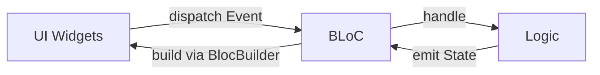
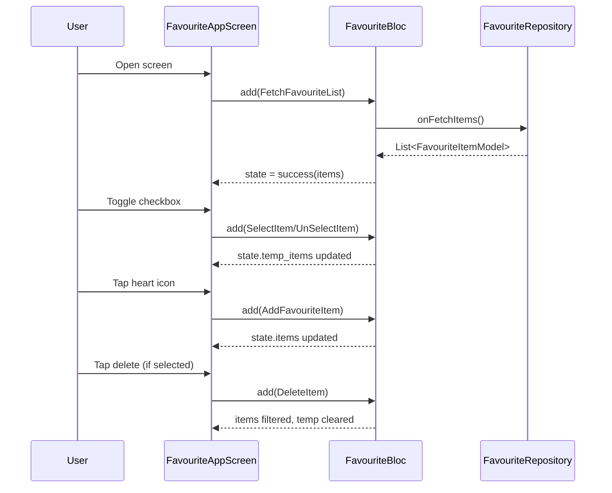
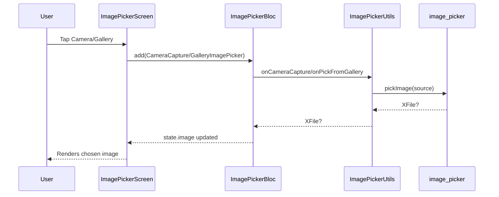

# BlocLabs 🔷 Flutter BLoC Showcase

    

> A compact, portfolio-ready Flutter project demonstrating clean BLoC state management across multiple mini-features: Counter, Slider & Switch, Favourites, Image Picker, ToDo, and an Equatable comparison demo.

---

## ✨ Highlights
- **Clean Architecture with BLoC**: Events → BLoC → Immutable States → UI.
- **Feature-first organization** with dedicated `bloc`, `ui`, `model`, and `repository` where applicable.
- **Real widgets** using `BlocBuilder`, `context.read<T>().add(...)`, and `copyWith` state transitions.
- **Async repository pattern** (mocked) for list fetching in the Favourites feature.

---

## 📁 Folder Structure & Architecture

```text
lib/
  main.dart                        # App entry, MultiBlocProvider
  counter_app/
    bloc/                          # Counter BLoC (events, states, bloc)
    ui/                            # CounterScreen UI
  equatable_demo/
    equatable_demo.dart            # Equatable vs manual equality demo
  favourite_app/
    bloc/                          # Favourite BLoC (events, states, bloc)
    model/                         # FavouriteItemModel
    repository/                    # FavouriteRepository (mock data)
    ui/                            # FavouriteAppScreen UI
  image_picker_demo/
    bloc/                          # ImagePicker BLoC (events, states, bloc)
    ui/                            # ImagePickerScreen UI
    utils/                         # ImagePickerUtils wrapper
  slider_and_switch_demo/
    bloc/
      slider/                      # Slider BLoC (opacity)
      switch/                      # Switch BLoC (notifications)
    ui/                            # SliderAndSwitchScreen UI
  todo_app/
    bloc/                          # ToDo BLoC (events, states, bloc)
    ui/                            # TodoScreen UI
```

- **Pattern**: Each feature encapsulates its own `bloc` (Events, States, Bloc), UI screen(s), and optional `model`/`repository`.
- **State immutability**: `Equatable`-based states and simple `copyWith` transitions.

---

## 🏗️ App Bootstrap

```dart
// lib/main.dart (excerpt)
return MultiBlocProvider(
  providers: [
    BlocProvider<CounterBloc>(create: (_) => CounterBloc()),
    BlocProvider<SwitchBloc>(create: (_) => SwitchBloc()),
    BlocProvider<SliderBloc>(create: (_) => SliderBloc()),
    BlocProvider<ImagePickerBloc>(create: (_) => ImagePickerBloc(ImagePickerUtils())),
    BlocProvider<ToDoBloc>(create: (_) => ToDoBloc()),
    BlocProvider<FavouriteBloc>(create: (_) => FavouriteBloc(FavouriteRepository())),
  ],
  child: MaterialApp(
    debugShowCheckedModeBanner: false,
    theme: ThemeData(useMaterial3: true, brightness: Brightness.dark),
    home: FavouriteAppScreen(),
  ),
);
```

---

## 📦 Features Overview

### 1) Counter App 🔢
- **Purpose**: Simple increment/decrement counter with BLoC.
- **Key classes**:
  - `CounterEvent` → `IncrementCounter`, `DecrementCounter`
  - `CounterState` → `counter: int`
  - `CounterBloc` → handles events and emits new counter values
- **UI**: `CounterScreen` renders the count and buttons that dispatch events.

```dart
// lib/counter_app/bloc/counter_bloc.dart (excerpt)
class CounterBloc extends Bloc<CounterEvent, CounterState> {
  CounterBloc() : super(const CounterState()) {
    on<IncrementCounter>(_onIncrement);
    on<DecrementCounter>(_onDecrement);
  }
  void _onIncrement(IncrementCounter event, Emitter<CounterState> emit) {
    emit(state.copyWith(counter: state.counter + 1));
  }
  void _onDecrement(DecrementCounter event, Emitter<CounterState> emit) {
    emit(state.copyWith(counter: state.counter - 1));
  }
}
```

```dart
// lib/counter_app/ui/counter_screen.dart (excerpt)
ElevatedButton.icon(
  onPressed: () => context.read<CounterBloc>().add(IncrementCounter()),
  label: const Text("Increment"),
  icon: const Icon(Icons.add_circle_rounded),
),
```

---

### 2) Slider & Switch Demo 🎚️🔔
- **Purpose**: Demonstrates two independent BLoCs: one for a boolean switch, one for a slider-driven opacity.
- **Key classes**:
  - `SwitchBloc` + `EnableOrDisableNotification` → toggles `SwitchState.isNotification`.
  - `SliderBloc` + `ChangeOpacity(opacity)` → updates `SliderState.opacity`.
- **UI**: `SliderAndSwitchScreen` uses `BlocBuilder` with `buildWhen` to avoid unnecessary rebuilds.

```dart
// lib/slider_and_switch_demo/bloc/switch/switch_bloc.dart (excerpt)
class SwitchBloc extends Bloc<SwitchEvent, SwitchState> {
  SwitchBloc() : super(SwitchState()) {
    on<EnableOrDisableNotification>(_onEnableOrDisableNotification);
  }
  void _onEnableOrDisableNotification(EnableOrDisableNotification e, Emitter<SwitchState> emit) {
    emit(state.copyWith(isNotification: !state.isNotification));
  }
}
```

```dart
// lib/slider_and_switch_demo/ui/slider_and_switch_screen.dart (excerpt)
BlocBuilder<SliderBloc, SliderState>(
  buildWhen: (previous, current) => previous.opacity != current.opacity,
  builder: (context, state) => Slider(
    value: state.opacity,
    onChanged: (value) => context.read<SliderBloc>().add(ChangeOpacity(opacity: value)),
  ),
),
```

---

### 3) Favourites App ❤️
- **Purpose**: Manage a list of items with selectable (temporary) and favourite states; supports bulk delete of selected items and toggle favourite.
- **Data source**: `FavouriteRepository` simulates async fetching with `Future.delayed`.
- **Key classes**:
  - `FavouriteItemModel` → `id`, `value`, `isFavourite`
  - `FavouriteEvents` → `FetchFavouriteList`, `AddFavouriteItem`, `SelectItem`, `UnSelectItem`, `DeleteItem`
  - `FavouriteState` → `items`, `temp_items`, `status: ListStatus`
  - `FavouriteBloc` → orchestrates selection, toggling, deletion, and initial fetch

```dart
// lib/favourite_app/repository/favourite_repository.dart (excerpt)
class FavouriteRepository {
  Future<List<FavouriteItemModel>> onFetchItems() async {
    await Future.delayed(const Duration(seconds: 3));
    return List.of(_onGenerateList(12));
  }
}
```

```dart
// lib/favourite_app/bloc/favourite_bloc.dart (excerpt)
FavouriteBloc(this.repository) : super(const FavouriteState()) {
  on<FetchFavouriteList>(onFetchList);
  add(FetchFavouriteList());
  on<AddFavouriteItem>(_onAddFavouriteItem);
  on<SelectItem>(_onSelectItem);
  on<UnSelectItem>(_onUnSelectItem);
  on<DeleteItem>(_onDeleteItems);
}
```

```dart
// lib/favourite_app/ui/favourite_app_screen.dart (excerpt)
IconButton(
  onPressed: () => context.read<FavouriteBloc>().add(DeleteItem()),
  icon: const Icon(Icons.delete_rounded),
  color: Colors.red,
),
```

- **States**:
  - `loading` → show `CircularProgressIndicator`
  - `success` → show list with selectable checkboxes and favourite toggle
  - `failure` → show error message

---

### 4) Image Picker 📸🖼️
- **Purpose**: Pick an image from camera or gallery using `image_picker`, managed by BLoC.
- **Key classes**:
  - `ImagePickerUtils` → wraps `ImagePicker` calls
  - `ImagePickerEvent` → `CameraCapture`, `GalleryImagePicker`
  - `ImagePickerState` → optional `XFile image`
  - `ImagePickerBloc` → invokes utils, emits selected file
- **UI**: `ImagePickerScreen` displays two actions until an image is chosen, then renders it.

```dart
// lib/image_picker_demo/bloc/image_picker_bloc.dart (excerpt)
Future<void> _onGalleryImagePicker(GalleryImagePicker event, Emitter<ImagePickerState> emit) async {
  final XFile? file = await utils.onPickFromGallery();
  emit(state.copyWith(image: file));
}
```

---

### 5) ToDo App ✅
- **Purpose**: Minimal ToDo list with add/remove functionality.
- **Key classes**:
  - `ToDoEvent` → `AddToDoEvent(task)`, `RemoveToDoEvent(task)`
  - `ToDoState` → `todos: List<String>`
  - `ToDoBloc` → manages an internal list and emits copies via `copyWith`
- **UI**: `TodoScreen` shows list or empty state; `FloatingActionButton` adds new tasks.

```dart
// lib/todo_app/bloc/todo_bloc.dart (excerpt)
void _onAddToDoEvent(AddToDoEvent event, Emitter<ToDoState> emit) {
  _todos.add(event.task);
  emit(state.copyWith(todos: List.from(_todos)));
}
```

---

### 6) Equatable Demo ⚖️
- **Purpose**: Illustrate equality semantics with and without `equatable`.
- **Key classes**:
  - `Person` (manual equality and `hashCode`)
  - `NewPerson extends Equatable` (auto equality via `props`)

```dart
// lib/equatable_demo/equatable_demo.dart (excerpt)
class NewPerson extends Equatable {
  final String name;
  final int age;
  const NewPerson({required this.name, required this.age});
  @override
  List<Object?> get props => [name, age];
}
```

---

## 🔄 Data Flow (BLoC)



- **Event**: triggered by UI interactions (button taps, toggles, slider changes).
- **BLoC**: business logic transforms events into new immutable states.
- **State**: immutable data consumed by UI via `BlocBuilder`.

---

## 🗺️ App Flow Diagrams

### Favourite App Flow


### Image Picker Flow


---

## 🧩 Key Concepts Used
- **`flutter_bloc`**: `BlocProvider`, `BlocBuilder`, event handlers via `on<Event>`.
- **`equatable`**: Lightweight value equality for states/events/models.
- **`copyWith` pattern**: Immutable state transitions.
- **Repository pattern**: Async data source abstraction (`FavouriteRepository`).
- **Separation of concerns**: UI is passive, BLoC holds logic.

---

## 🎯 Quick Reference Tables

### Counter
| Component | Location | Notes |
|---|---|---|
| Events | `counter_event.dart` | `IncrementCounter`, `DecrementCounter` |
| State | `counter_state.dart` | `counter: int` |
| Bloc | `counter_bloc.dart` | Adds/subtracts; emits `copyWith` |
| UI | `counter_screen.dart` | Two buttons dispatch events |

### Slider & Switch
| Component | Location | Notes |
|---|---|---|
| Switch Bloc | `switch_bloc.dart` | Toggles notifications |
| Slider Bloc | `slider_bloc.dart` | Changes opacity |
| UI | `slider_and_switch_screen.dart` | `buildWhen` optimizations |

### Favourites
| Component | Location | Notes |
|---|---|---|
| Model | `favourite_item_model.dart` | `id`, `value`, `isFavourite` |
| Repo | `favourite_repository.dart` | Mock fetch with delay |
| Events | `favourite_event.dart` | Fetch, Select/Unselect, Add, Delete |
| State | `favourite_state.dart` | `items`, `temp_items`, `status` |
| Bloc | `favourite_bloc.dart` | Selection, toggle fav, bulk delete |
| UI | `favourite_app_screen.dart` | List, checkbox, heart, delete |

### Image Picker
| Component | Location | Notes |
|---|---|---|
| Utils | `image_picker_utils.dart` | Camera/Gallery wrappers |
| Events | `image_picker_event.dart` | Capture or pick |
| State | `image_picker_state.dart` | `XFile? image` |
| Bloc | `image_picker_bloc.dart` | Emits chosen file |
| UI | `image_picker_screen.dart` | Renders image or actions |

### ToDo
| Component | Location | Notes |
|---|---|---|
| Events | `todo_event.dart` | Add/Remove |
| State | `todo_state.dart` | `todos: List<String>` |
| Bloc | `todo_bloc.dart` | Internal list + `copyWith` |
| UI | `todo_screen.dart` | FAB adds tasks, delete removes |

---

## 🖌️ UI Glimpses (Code Excerpts)

```dart
// Checkbox selection in favourites
Checkbox(
  value: state.temp_items.contains(item),
  onChanged: (value) {
    if (value == true) {
      context.read<FavouriteBloc>().add(SelectItem(item: item));
    } else {
      context.read<FavouriteBloc>().add(UnSelectItem(item: item));
    }
  },
)
```

```dart
// Todo: add new task
FloatingActionButton(
  onPressed: () {
    final length = context.read<ToDoBloc>().state.todos.length;
    context.read<ToDoBloc>().add(AddToDoEvent(task: 'Task: ${length + 1}'));
  },
  child: const Icon(Icons.add_rounded, size: 25),
)
```

---

## 🛠️ Tech Used
- **Flutter** (Material 3 theme, dark mode)
- **Dart** (null-safety)
- **flutter_bloc** for BLoC pattern
- **equatable** for value equality
- **image_picker** for camera/gallery integration

---

## 📌 Notes
- The app’s home is set to `FavouriteAppScreen()` in `main.dart`. Swap to other screens for demos.
- All states and events are `equatable` where applicable to ensure efficient widget rebuilds.

---

Made with ❤️ using Flutter + BLoC.
