# 🧪 BlocLabs - Flutter BLoC Pattern Showcase


A comprehensive Flutter project demonstrating various **BLoC (Business Logic Component)** patterns and state management techniques. This repository serves as a complete learning resource and reference implementation for Flutter developers looking to master BLoC architecture with real-world examples.

## 🎯 Project Overview

BlocLabs is a multi-feature Flutter application that showcases different aspects of BLoC pattern implementation, from basic counter functionality to complex API integrations and native device features. Each module is designed to demonstrate specific BLoC concepts and best practices.

## 🚀 Features & Modules

| 🎨 Feature | 📝 Description | 🎓 Learning Focus | 🔧 Key Technologies |
|------------|----------------|-------------------|-------------------|
| 🔐 **Authentication** | Login form with real API integration | Form validation, HTTP requests, Error handling | `http`, `flutter_bloc`, API integration |
| ➕ **Counter App** | Simple increment/decrement counter | Basic BLoC implementation, Event handling | Core BLoC pattern, State management |
| ❤️ **Favorites Manager** | Interactive item selection with favorites | Complex state handling, List operations | Repository pattern, Multi-selection |
| 📡 **API Integration** | Fetch and display posts from REST API | HTTP requests, JSON parsing, Loading states | `http`, Repository pattern, Error handling |
| 🔍 **Filter & Search** | Real-time filtering of API data | Data manipulation, Search functionality | Stream handling, Data filtering |
| 🖼️ **Image Picker** | Camera capture & gallery selection | Native device integration | `image_picker`, File handling |
| 🎚️ **Slider & Switch** | Interactive UI controls with reactive state | Multiple BLoC providers, UI state sync | Multi-BLoC architecture |
| ✅ **Todo Manager** | Add/remove tasks with dynamic list | List management, CRUD operations | Dynamic list handling |
| ⚖️ **Equatable Demo** | Object comparison demonstration | Equatable package usage, Performance | `equatable`, Object equality |
| 🧊 **Freezed Demo** | Code generation with Freezed package | Immutable classes, JSON serialization | `freezed`, Code generation |

## 🏗️ Architecture & Project Structure

### 📁 Folder Structure
```
lib/
├── 🔐 authentication_app/
│   ├── bloc/ (LoginBloc, Events, States)
│   └── ui/ (LoginScreen)
├── ➕ counter_app/
│   ├── bloc/ (CounterBloc, Events, States)
│   └── ui/ (CounterScreen)
├── ❤️ favourite_app/
│   ├── bloc/ (FavouriteBloc, Events, States)
│   ├── model/ (FavouriteItemModel)
│   ├── repository/ (FavouriteRepository)
│   └── ui/ (FavouriteAppScreen)
├── 📡 get_api_demo/
│   ├── bloc/ (PostsBloc, Events, States)
│   ├── model/ (PostModel)
│   ├── repository/ (PostRepository)
│   ├── utils/ (Enums)
│   └── ui/ (PostsScreen)
├── 🔍 filter_api_list_demo/
├── 🖼️ image_picker_demo/
├── 🎚️ slider_and_switch_demo/
├── ✅ todo_app/
├── ⚖️ equatable_demo/
├── 🧊 freezed_package_demo/
└── main.dart
```

### 🔄 BLoC Architecture Flow

```mermaid
graph TB
    A[🎯 User Interaction] --> B[📤 Event Dispatch]
    B --> C[🧠 BLoC Processing]
    C --> D[📊 State Emission]
    D --> E[🎨 UI Rebuild]
    E --> F[👀 User Sees Update]
    
    subgraph "BLoC Layer"
        C --> G[Business Logic]
        G --> H[Data Processing]
        H --> I[Repository Calls]
    end
    
    subgraph "UI Layer"
        E --> J[BlocBuilder]
        E --> K[BlocListener]
        E --> L[BlocConsumer]
    end
```



## 🧩 Detailed Module Implementation

### 1. 🔐 Authentication Module

**Real-world login implementation with API integration**

```dart
// Key Components
class LoginBloc extends Bloc<LoginEvent, LoginState> {
  // Handles email/password validation and API calls
  void _onLoginAPI(LoginAPI event, Emitter<LoginState> emit) async {
    emit(state.copyWith(status: LoginStatus.loading));
    // API call to https://reqres.in/api/login
  }
}
```

**Features:**
- ✅ Real-time form validation
- ✅ HTTP API integration (`https://reqres.in/api/login`)
- ✅ Loading states and error handling
- ✅ Snackbar notifications

**Flow Diagram:**


### 2. ➕ Counter App Module

**Foundation BLoC pattern demonstration**

```dart
class CounterBloc extends Bloc<CounterEvent, CounterState> {
  CounterBloc() : super(const CounterState()) {
    on<IncrementCounter>(_onIncrement);
    on<DecrementCounter>(_onDecrement);
  }
  
  void _onIncrement(IncrementCounter event, Emitter<CounterState> emit) {
    emit(state.copyWith(counter: state.counter + 1));
  }
}
```

**Learning Points:**
- 🎯 Basic event-to-state transformation
- 🎯 Immutable state management
- 🎯 BlocBuilder usage patterns

### 3. ❤️ Favorites Manager Module

**Complex state management with repository pattern**

```dart
class FavouriteBloc extends Bloc<FavouriteEvents, FavouriteState> {
  List<FavouriteItemModel> items = [];
  List<FavouriteItemModel> temp_items = []; // Selection tracking
  FavouriteRepository repository;
  
  // Handles: Add/Remove favorites, Multi-selection, Bulk delete
}
```

**Advanced Features:**
- 🔥 Multi-item selection with checkboxes
- 🔥 Bulk operations (delete selected items)
- 🔥 Repository pattern for data management
- 🔥 Complex UI state synchronization

**State Flow:**


### 4. 📡 API Integration Module

**HTTP requests with proper error handling**

```dart
class PostRepository {
  Future<List<PostModel>> onFetchPosts() async {
    final response = await http.get(
      Uri.parse('https://jsonplaceholder.typicode.com/comments'),
      headers: {'Content-Type': 'application/json'},
    );
    
    if (response.statusCode == 200) {
      final posts = json.decode(response.body) as List;
      return posts.map((e) => PostModel.fromJson(e)).toList();
    }
    throw Exception("Error on fetching posts");
  }
}
```

**Implementation Highlights:**
- 🌐 JSONPlaceholder API integration
- 🌐 Proper HTTP error handling
- 🌐 JSON serialization/deserialization
- 🌐 Loading states management

### 5. 🖼️ Image Picker Module

**Native device integration with camera and gallery**

```dart
class ImagePickerUtils {
  final ImagePicker _picker = ImagePicker();
  
  Future<XFile?> onCameraCapture() async {
    return await _picker.pickImage(source: ImageSource.camera);
  }
  
  Future<XFile?> onPickFromGallery() async {
    return await _picker.pickImage(source: ImageSource.gallery);
  }
}
```

**Native Features:**
- 📸 Camera capture functionality
- 📸 Gallery image selection
- 📸 File handling and display
- 📸 Cross-platform compatibility

### 6. 🎚️ Slider & Switch Module

**Multiple BLoC providers demonstration**

```dart
// Multiple BLoCs working together
return MultiBlocProvider(
  providers: [
    BlocProvider<SwitchBloc>(create: (context) => SwitchBloc()),
    BlocProvider<SliderBloc>(create: (context) => SliderBloc()),
  ],
  child: SliderAndSwitchScreen(),
);
```

**Key Concepts:**
- 🎛️ Multiple BLoC coordination
- 🎛️ Independent state management
- 🎛️ UI control synchronization
- 🎛️ Performance optimization with `buildWhen`

### 7. ✅ Todo Manager Module

**Dynamic list management with CRUD operations**

```dart
class ToDoBloc extends Bloc<ToDoEvent, ToDoState> {
  final List<String> _todos = [];
  
  void _onAddToDoEvent(AddToDoEvent event, Emitter<ToDoState> emit) {
    _todos.add(event.task);
    emit(state.copyWith(todos: List.from(_todos)));
  }
  
  void _onRemoveToDoEvent(RemoveToDoEvent event, Emitter<ToDoState> emit) {
    _todos.remove(event.task);
    emit(state.copyWith(todos: List.from(_todos)));
  }
}
```

**Features:**
- ✏️ Dynamic task addition
- ✏️ Task removal functionality
- ✏️ List state management
- ✏️ FloatingActionButton integration

### 8. ⚖️ Equatable Demo Module

**Object comparison and performance optimization**

```dart
// Manual comparison (verbose)
class Person {
  @override
  bool operator ==(Object other) => 
    identical(this, other) || 
    other is Person && name == other.name && age == other.age;
}

// Equatable package (clean)
class NewPerson extends Equatable {
  @override
  List<Object?> get props => [name, age];
}
```

**Learning Benefits:**
- ⚡ Performance optimization in BLoC
- ⚡ Reduced unnecessary rebuilds
- ⚡ Clean object comparison
- ⚡ HashCode generation

### 9. 🧊 Freezed Package Demo

**Code generation with immutable classes**

```dart
@freezed
abstract class AnimalModel with _$AnimalModel {
  const factory AnimalModel({
    @Default('') String name, 
    @Default(0) int age, 
    @Default([]) List<String> petName
  }) = _AnimalModel;

  factory AnimalModel.fromJson(Map<String, dynamic> json) => 
    _$AnimalModelFromJson(json);
}
```

**Advanced Features:**
- 🧊 Automatic code generation
- 🧊 Immutable data classes
- 🧊 JSON serialization/deserialization
- 🧊 CopyWith functionality
- 🧊 Union types support

## 🔧 Technical Implementation Details

### 📦 Dependencies Used

```yaml
dependencies:
  flutter_bloc: ^9.1.1      # State management
  bloc: ^9.0.1              # Core BLoC library
  equatable: ^2.0.7         # Object comparison
  http: ^1.5.0              # HTTP requests
  image_picker: ^1.2.0      # Native image selection
  cupertino_icons: ^1.0.8   # iOS-style icons
  freezed_annotation: ^3.1.0 # Freezed annotations
  json_annotation: ^4.9.0   # JSON annotations

dev_dependencies:
  build_runner: ^2.9.0      # Code generation
  freezed: ^3.2.3           # Immutable classes
  json_serializable: ^6.11.1 # JSON serialization
```

### 🎨 App Theme & UI

```dart
MaterialApp(
  theme: ThemeData(
    useMaterial3: true, 
    brightness: Brightness.dark
  ),
  // Dark theme with Material 3 design
)
```

### 🔄 State Management Patterns

**1. Single BLoC Provider:**
```dart
BlocProvider(
  create: (context) => CounterBloc(),
  child: CounterScreen(),
)
```

**2. Multiple BLoC Providers:**
```dart
MultiBlocProvider(
  providers: [
    BlocProvider<SwitchBloc>(create: (context) => SwitchBloc()),
    BlocProvider<SliderBloc>(create: (context) => SliderBloc()),
    // ... more providers
  ],
  child: MyApp(),
)
```

**3. BLoC Widgets Usage:**
```dart
// For UI updates
BlocBuilder<CounterBloc, CounterState>(
  builder: (context, state) => Text('${state.counter}'),
)

// For side effects
BlocListener<LoginBloc, LoginState>(
  listener: (context, state) {
    if (state.status == LoginStatus.failure) {
      ScaffoldMessenger.of(context).showSnackBar(/*...*/);
    }
  },
)
```

## 🎮 App Flow & User Journey

```mermaid
graph TD
    A[🚀 App Launch] --> B[🧊 Freezed Demo Screen]
    B --> C[🔐 Login Screen]
    C --> D{Login Success?}
    D -->|Yes| E[🏠 Main Navigation]
    D -->|No| F[❌ Error Message]
    F --> C
    
    E --> G[➕ Counter Demo]
    E --> H[❤️ Favorites Demo]
    E --> I[📡 API Demo]
    E --> J[🖼️ Image Picker]
    E --> K[🎚️ Controls Demo]
    E --> L[✅ Todo Demo]
    E --> M[🔍 Filter Demo]
    
    G --> N[🔄 Increment/Decrement]
    H --> O[💖 Toggle Favorites]
    I --> P[📊 Load Posts]
    J --> Q[📸 Camera/Gallery]
    K --> R[🎛️ Slider/Switch]
    L --> S[✏️ Add/Remove Tasks]
    M --> T[🔍 Search & Filter]
```



## 🎯 Learning Outcomes

After exploring this project, developers will understand:

### 🎓 Core BLoC Concepts
- ✅ Event-driven architecture
- ✅ Immutable state management
- ✅ Separation of concerns
- ✅ Reactive programming patterns

### 🎓 Advanced Patterns
- ✅ Repository pattern implementation
- ✅ Multiple BLoC coordination
- ✅ Error handling strategies
- ✅ Performance optimization techniques

### 🎓 Real-world Integration
- ✅ HTTP API consumption
- ✅ Native device features
- ✅ Form validation
- ✅ Complex UI state management

### 🎓 Code Generation & Tools
- ✅ Freezed package for immutable classes
- ✅ JSON serialization automation
- ✅ Build runner integration
- ✅ Code generation best practices

### 🎓 Best Practices
- ✅ Code organization and structure
- ✅ Testing strategies (widget tests included)
- ✅ Performance considerations
- ✅ Maintainable architecture

## 📱 Key Implementation Highlights

### 🔥 Multi-BLoC Provider Setup
The app demonstrates how to manage multiple BLoCs efficiently:

```dart
MultiBlocProvider(
  providers: [
    BlocProvider<SwitchBloc>(create: (context) => SwitchBloc()),
    BlocProvider<SliderBloc>(create: (context) => SliderBloc()),
    BlocProvider<ImagePickerBloc>(create: (context) => ImagePickerBloc(ImagePickerUtils())),
    BlocProvider<ToDoBloc>(create: (context) => ToDoBloc()),
    BlocProvider<FavouriteBloc>(create: (context) => FavouriteBloc(FavouriteRepository())),
    BlocProvider<PostsBloc>(create: (context) => PostsBloc()),
    BlocProvider<FilterPostsBloc>(create: (context) => FilterPostsBloc()),
  ],
  child: MaterialApp(/* ... */),
)
```

### 🔥 Repository Pattern Implementation
Clean separation of data layer from business logic:

```dart
class FavouriteRepository {
  Future<List<FavouriteItemModel>> onFetchItems() async {
    await Future.delayed(const Duration(seconds: 3));
    return List.of(_onGenerateList(12));
  }

  List<FavouriteItemModel> _onGenerateList(int length) {
    return List.generate(length, (index) => 
      FavouriteItemModel(id: '$index', value: 'Item $index'));
  }
}
```

### 🔥 Error Handling Strategy
Comprehensive error handling across all modules:

```dart
Future<void> onFetchPosts(PostsFetched event, Emitter<PostsState> emit) async {
  await repo
      .onFetchPosts()
      .then((value) {
        emit(state.copyWith(status: PostsStatus.success, posts: value));
      })
      .catchError((error, stackTrace) {
        emit(state.copyWith(status: PostsStatus.failure, message: error.toString()));
      });
}
```

## 🔍 Code Quality & Standards

- **Architecture**: Clean Architecture with BLoC pattern
- **State Management**: Immutable states with Equatable
- **Error Handling**: Comprehensive try-catch blocks
- **Code Style**: Follows Dart/Flutter conventions
- **Performance**: Optimized rebuilds with `buildWhen`
- **Code Generation**: Freezed and JSON serialization
- **Testing**: Widget tests included in `/test` directory

## 🚀 Performance Optimizations

### 1. **Selective Rebuilds**
```dart
BlocBuilder<CounterBloc, CounterState>(
  buildWhen: (previous, current) => false, // Prevents unnecessary rebuilds
  builder: (context, state) => ElevatedButton(/*...*/),
)
```

### 2. **Equatable Integration**
All state classes extend Equatable for efficient comparison:
```dart
class CounterState extends Equatable {
  final int counter;
  const CounterState({this.counter = 0});
  
  @override
  List<Object?> get props => [counter];
}
```

### 3. **Immutable Data Models**
Using Freezed for automatic immutable class generation:
```dart
@freezed
abstract class AnimalModel with _$AnimalModel {
  const factory AnimalModel({
    @Default('') String name,
    @Default(0) int age,
  }) = _AnimalModel;
}
```

---

*This project serves as a comprehensive reference for Flutter developers learning BLoC pattern. Each module is self-contained and demonstrates specific concepts, making it easy to understand and implement in real-world applications.*